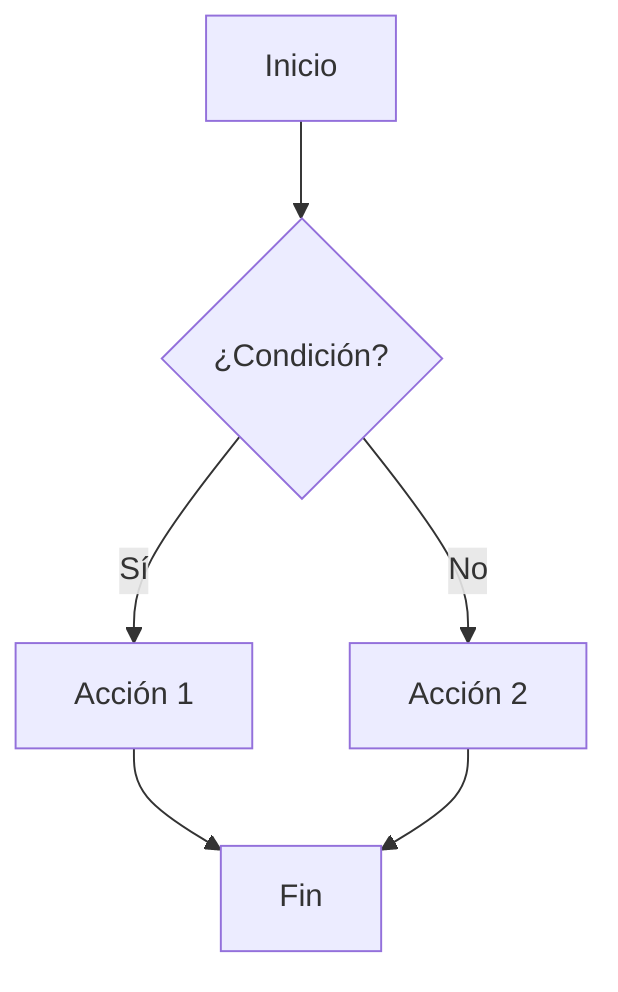
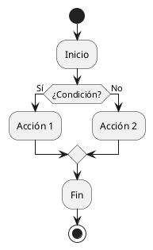

# marktile


Conversor de Markdown a Textile en Python.

## ¿Qué hace?

Convierte un fichero en formato .MD a .TEXTILE, remplazando los bloques de código [PlantUML](https://plantuml.com/) y [Mermaid](https://mermaid.js.org/) por imágenes.

## ¿Cómo se usa?

```bash
$ marktile --file fichero.md --output destino
```

> Si no se especifica el directorio de destino, la salida se genera en el directorio `output` por defecto.

Para obtener ayuda sobre cómo usar el comando, se puede utilizar la opción `--help`:

```bash
$ marktile --help

Uso: marktile (-h | -v | --file FILE) [--output [DIR]]

Markdown to Textile converter (v0.1.2)

Comandos:
  -h, --help      Muestra esta ayuda y termina
  -v, --version   Mostrar versión
  --file FILE     Fichero en formato Markdown a convertir a Textile

Opciones:
  --output [DIR]  Directorio de destino para los ficheros convertidos
```

### Ejemplo de uso

Partiendo del documento [`test.md`](tests/test.md) en formato Markdown, que contiene tablas, listas y diagramas de flujo en formato `mermaid` y `plantuml`:

```markdown
# Casos de prueba de marktile

## Diagramas Mermaid

En este caso de prueba se intenta renderizar un diagrama de flujo en formato `mermaid` usando `marktile`.

> La idea es verificar que el diagrama se renderiza correctamente y se incluye en el documento `.textile` de salida.

### Diagrama Mermaid



## Diagrama PlantUML

En este caso de prueba se intenta renderizar un diagrama de flujo en formato `plantuml` usando `marktile`.

> La idea es verificar que el diagrama se renderiza correctamente y se incluye en el documento `.textile` de salida.

### Diagrama PlantUML



## Tablas

En este caso de prueba se muestran las tablas en marktile y su formato:

| Nombre | Edad | Ciudad     |
|--------|------|------------|
| Juan   | 25   | Madrid     |
| Ana    | 30   | Barcelona  |
| Pedro  | 22   | Valencia   |
| Laura  | 28   | Sevilla    |
| Carlos | 35   | Bilbao     |

## Listas

1. Casos de uso específicos con descripciones.
2. Flujos de trabajo del usuario.
3. Restricciones y validaciones necesarias.
```

Ejecutamos `marktile` un fichero `fichero.md` a `fichero.textile`, se puede usar el siguiente comando:

```bash
$ marktile --file test.md --output .
Convirtiendo fichero Markdown a Textile...
Fichero de entrada           : test.md
Directorio de salida         : .
Imagenes generadas para bloques: ['.\\test_1.png', '.\\test_2.png']
Fichero Textile generado     : .\test.textile
```

Esto generará un fichero [`test.textile`](/tests/test.textile) y una imagen `test_*.png` por cada diagrama en el directorio indicado (en este caso, el directorio actual `.`), con el siguiente contenido:

```textile
h1(#casos-de-prueba-de-marktile). Casos de prueba de marktile

h2(#diagramas-mermaid). Diagramas Mermaid

En este caso de prueba se intenta renderizar un diagrama de flujo en formato @mermaid@ usando @marktile@.

bq. La idea es verificar que el diagrama se renderiza correctamente y se incluye en el documento @.textile@ de salida.


h3(#diagrama-mermaid). Diagrama Mermaid

!test_1.png!

h2(#diagrama-plantuml). Diagrama PlantUML

En este caso de prueba se intenta renderizar un diagrama de flujo en formato @plantuml@ usando @marktile@.

bq. La idea es verificar que el diagrama se renderiza correctamente y se incluye en el documento @.textile@ de salida.


h3(#diagrama-plantuml-1). Diagrama PlantUML

!test_2.png!

h2(#tablas). Tablas

En este caso de prueba se muestran las tablas en marktile y su formato:

|_. Nombre|_. Edad|_. Ciudad|
|Juan|25|Madrid|
|Ana|30|Barcelona|
|Pedro|22|Valencia|
|Laura|28|Sevilla|
|Carlos|35|Bilbao|

h2(#listas). Listas

# Casos de uso específicos con descripciones.
# Flujos de trabajo del usuario.
# Restricciones y validaciones necesarias.
```

Y las imágenes generadas serán:

- [`test_1.png`](tests/test_1.png) para el diagrama `mermaid`
- [`test_2.png`](tests/test_2.png) para el diagrama `plantuml`

## ¿Cómo se instala?

Para instalar **marktile** en tu sistema, puedes hacerlo desde el repositorio de GitHub con el comando `pip` (debes ejecutarlo como Administrador en Windows o con `sudo` en Linux):

```bash
pip install git+https://github.com/fvarrui/marktile.git
```

> Por supuesto, debes tener Python instalado en tu sistema.

Si ya has instalado alguna versión de `marktile`, puedes actualizarlo con el siguiente comando:

```bash
pip install --upgrade --force-reinstall --no-cache-dir git+https://github.com/fvarrui/marktile.git
```

## Para desarrolladores

Si quieres colaborar en el desarrollo de **marktile**, puedes hacerlo de la siguiente manera.

Clonar el repositorio y entrar en el directorio:

```bash
git clone https://github.com/fvarrui/marktile.git
cd marktile
```

Crear un entorno virtual (si no lo hemos hecho antes):

```bash
python -m venv venv
```

Activar el entorno virtual:

```bash
venv\Scripts\activate
```

Instalar el paquete en modo de edición, de modo que se crearán los scripts del paquete y se instalarán las dependencias en el entorno virtual:

```bash
pip install -e .
```

¡Y a programar!

```bash
code .
```

## ¿Cómo contribuir?

¡Tus PRs son bienvenidos!

--- 

Made with ❤️ by [fvarrui](https://github.com/fvarrui)