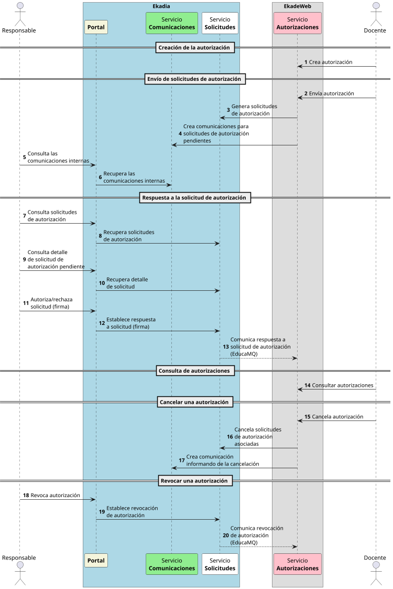

--- 
title: "Servicio de Autorizaciones"
subtitle: "Sistema de Información del Servicio de Autorizaciones"
date: 2025-04-10
revisions:
  - date: "2025-04-09"
    description: "Creación del documento"
    author: "Francisco Vargas"
  - date: "2025-04-10"
    description: "Modificación del documento"
    author: "Chuck Norris"
---

\newpage

# HISTORIAL DE REVISIONES

\revisions

\newpage

# OBJETIVO

En este punto se debe describir el propósito de este documento.

# ALCANCE

En este punto se deben describir las unidades organizativas a las que se dirige este documento de Análisis Orientado a Objetos del Sistema de Información y que participarán en su generación, validación y registro.

# DEFINICIÓN DEL SISTEMA

Se deberá describir brevemente el sistema desde el punto de vista funcional.

## Determinación del alcance del sistema

### Delimitación del sistema

El objetivo de este punto es determinar el alcance del sistema, esto es, indicar que procesos de alto nivel pertenecen al ámbito del sistema. Para ello se deberá recurrir a un Diagrama de Flujo de Datos (DFD) donde se refleje de forma clara y precisa los procesos generales que forman parte del sistema de información.

Lo importante es representar el flujo o movimiento de los datos a través del sistema y sus transformaciones al ejecutar los procesos. En este apartado, el DFD será de alto nivel, de forma que en los puntos sucesivos de este documento de análisis se deberá ir detallando los procesos en profundidad.

### Contexto del sistema

El objetivo de este punto es determinar el contexto del sistema, esto es, especificar los casos de usos generales directamente relacionados con cada uno de los actores del sistema a los que se quiere dar respuesta en el sistema de información. Para ello se deberá mostrar un

Diagrama de Casos de Uso donde se refleje de forma clara y precisa el comportamiento del sistema desde el punto de vista de los usuarios. En este apartado, el diagrama será de alto nivel, de forma que en los puntos sucesivos de este documento de análisis se deberá ir detallando en niveles sucesivos hasta llegar a casos de uso sencillos y manejables..

## Identificación del entorno tecnológico

El objetivo de este punto es definir, a alto nivel, el entorno tecnológico que se requiere, especificando sus posibles condicionantes y restricciones. Para ello se deberá recurrir a un Diagrama de Representación donde se realice una descripción general del entorno tecnológico. Se trata de un diagrama libre, en el que se utiliza cualquier objeto gráfico con el fin de reflejar algo de interés para el caso.

## Especificación de estándares y normas

El objetivo de este punto consiste en especificar los estándares, las normativas, leyes o recomendaciones que deberán tenerse en cuenta, según los requisitos del cliente, en el sistema de información a desarrollar.

# MODELOS DE CASOS DE USO

## Especificación de los Casos de Uso

El objetivo de esta tarea es detallar y ampliar el Diagrama de Casos de Uso del punto Contexto del sistema. Esta diagrama actualizado tendrá como objetivo detectar todos los posibles casos de uso de primer nivel o alto nivel existentes en el sistema, pudiéndose incluso detectar casos de uso que extiendan de varios o se incluyan en otros.

## Detalle de los Casos de Uso

En este punto se detallan los casos de uso de alto nivel identificados en la tarea anterior, y si es necesario, se subdividen en otros más sencillos. El objetivo es tener casos de uso sencillos perfectamente definidos y que en conjunto describan perfectamente las funcionalidades que debe ofrecer el sistema de información.

|Caso de Uso|\<Nombre del caso de uso\>|
|---|---|
|Descripción|\<Descripción del caso de uso\>|
|Actor principal|\<Actor principal\>|
|Precondiciones|\<Condiciones de inicio\>|
|Postcondiciones|\<Condiciones de fin, garantías de éxito\>|
|Flujo básico|\<Paso 1\> \<Paso 2\> \<Paso 3\> …|
|Flujos alternativos|\<Flujo alternativo …\> \<Flujo alternativo…\>|
|Condiciones de Fallo|Fallo 1 Fallo 2|
|Notas|Nota 1  Nota 2|

Sirva como ejemplo ilustrativo:

|Caso de Uso|Acceso Certificado Digital|
|---|---|
|Descripción|Autenticación de las credenciales de acceso del Usuario mediante certificado digital.|
|Actor principal|Usuarios del aplicativo|
|Precondiciones|El caso de uso se inicia cuando un Usuario accede a la aplicación.|
|Postcondiciones|Permiso o denegación de acceso a la aplicación.|
|Flujo básico|1. El Usuario accede a la aplicación. 2. El Sistema comprueba sus credenciales, certificado digital. 3. El Sistema valida los datos de acceso y en el caso de que sean correctos muestra la lista de Provincias a las que tiene acceso, seleccionando por defecto, la Provincia a la que está asociado. 4. El Usuario selecciona la Provincia y valida la selección. 5. El Sistema registrará la parametrización de la Provincia, ya que el Usuario sólo podrá acceder a los expedientes de la Provincia seleccionada al acceder a la aplicación. 6. El Sistema permite el acceso a la aplicación.|
|Flujos alternativos|En el caso de que el Usuario no tenga acceso a más de una Provincia, no hará falta su selección. Una vez se ha accedido a la aplicación, el Sistema gestionará avisos y alarmas: Solicitudes presentadas en los Ayuntamientos pendientes.|
|Condiciones de Fallo|Certificado incorrecto o no instalado. Usuario inexistente.|
|Notas|En función de los permisos asignados al usuario, éste tendrá limitada la visibilidad... Es importante mencionar que con la Ley de Protección de Datos, los datos de acceso del Usuario deben ser utilizados únicamente por la persona autorizada… Un Usuario únicamente podrá tener **una sesión activa a la vez**, es decir, dos personas no podrán compartir el mismo Usuario para realizar ejecuciones simultáneamente.|

# MODELO DE SUBSISTEMAS

Este punto es opcional, ya que sólo se realizará la descomposición del sistema en subsistemas para el caso de sistemas de información complejos.

## Especificación de los Subsistemas de Análisis

El objetivo de esta tarea es detallar a través de un Diagrama de Flujo de Datos, los procesos de primer nivel o alto nivel que describen a los distintos subsistemas en los que se subdivide el sistema de información. Se tendrá que tener en cuenta el punto Delimitación del sistema de este documento.

## Detalle de los Procesos

En este punto se detallan los procesos de alto nivel identificados en el punto anterior, y si es necesario, se subdividen en otros más sencillos. El objetivo es tener procesos sencillos perfectamente definidos y que en conjunto describan perfectamente los subsistemas en los que se divide el sistema de información.

## Integración de Subsistemas de Análisis

El objetivo de esta tarea es la coordinación de los distintos modelos de análisis de cada subsistema. Como consecuencia de la coordinación de los modelos, se pueden identificar elementos comunes, dependencias o interfaces. Se usarán los Diagramas de Paquetes, agrupando los elementos del análisis y detallando las relaciones de dependencia entre ellos.

# MODELO DE DATOS 

## Elaboración del modelo conceptual de datos

## Elaboración del modelo lógico de datos

## Normalización del modelo lógico de datos

## Especificación de necesidades de migración de datos y carga inicial

# MODELO DE CLASES

## Diagrama de clases

El objetivo de esta tarea es detallar a través de un Diagrama de Clases todas las clases del sistema, así como las relaciones entre ellas. Para ello se tendrá en cuenta los diagramas de flujo y de casos de uso definidos en los puntos anteriores de este documento.

## Definición de clases

En este punto se detallan todas las clases del sistema. Se identificarán, entre otros datos, los atributos y operaciones que puedan desarrollar cada una de las clases.

## Diagrama de Transición de Estados (opcional)

En este punto se representa el comportamiento en el tiempo del sistema, mediante los estados que pueden tomar los objetos y los eventos u operaciones que permiten el cambio de un estado a otro. Se realiza para aquellas clases cuyo comportamiento dependa del estado en el que se encuentren.

## Diagrama de Secuencias (opcional)

En este punto se representa el comportamiento en el tiempo del sistema mediante el uso de diagramas de secuencia, cuyo objetivo es describir el comportamiento dinámico del sistema de información haciendo énfasis en la secuencia de los mensajes intercambiados por los objetos.

# DEFINICIÓN DE INTERFACES DE USUARIO (opcional)

En esta actividad se especifican las interfaces entre el sistema y el usuario: formatos de pantallas, diálogos, e informes, principalmente. Opcionalmente, se recomienda la utilización de prototipos.

## Principios Generales de la Interfaz

El objetivo de esta tarea es especificar los estándares, directrices y elementos generales a tener en cuenta en la definición de la interfaz de usuario, tanto para la interfaz interactiva (gráfica o carácter), como para los informes y formularios impresos.

### Interfaz Interactiva

En este punto se describe el entorno de la interfaz interactiva (gráfico, carácter, etc.) según los requisitos del sistema, y se determinan los principios de diseño de la interfaz de usuario, contemplando:

- Directrices generales en cuanto a la interfaz y aspectos generales de interacción.
- Principios de composición de pantallas y criterios de ubicación de los distintos elementos dentro de cada formato.
- Normas para los mensajes de error y aviso, codificación, presentación y comportamientos.
- Normas para la presentación de ayudas.

### Interfaz de Impresión

En este punto se describe el entorno de la interfaz de impresión, contemplando:

- Directrices generales.
- Principios de composición de informes y formularios.
- Normas de elaboración, distribución y salvaguarda de la información.

## Formatos de la Interfaz de Pantalla

El objetivo de esta tarea es especificar cada formato individual de la interfaz de pantalla, desde el punto de vista estático. Para cada proceso en línea identificado en las tareas anteriores o en la especificación de los casos de uso, y teniendo en cuenta los formatos estándar definidos en la tarea Principios Generales de la Interfaz, se definen los formatos individuales de la interfaz de pantalla requerida para completar la especificación de cada diálogo. Se deberá describir el formato de las pantallas concretas a generar.

## Comportamiento Dinámico de la Interfaz

El objetivo de esta tarea es definir los flujos entre los distintos formatos de interfaz de pantalla, y también dentro del propio formato. Este comportamiento se describe mediante un modelo de navegación de interfaz de pantalla.

Para cada pantalla o ventana, definido en la tarea Formatos de la Interfaz de Pantalla, se establece la entrada lógica de los datos y las reglas de validación. Además, se analiza y determina la secuencia de acciones específicas para completar cada diálogo, así como las condiciones que se deben cumplir para su inicio, y las posibles restricciones durante su ejecución.

## Formatos de Impresión

El objetivo de esta tarea es especificar los formatos y características de las salidas o entradas impresas del sistema. De acuerdo a los estándares establecidos en la tarea Principios Generales de la Interfaz, se definen los formatos individuales de informes y formularios, estos últimos si son necesarios..

# ESPECIFICACIÓN DE PRUEBAS

El objetivo de esta tarea es la definición inicial del plan de pruebas. Provee del marco adecuado para elaborar una planificación paso a paso de las actividades de prueba. Dicho plan se va completando y detallando a medida que se avanza en los restantes procesos del ciclo de vida del software.

## Definición del Alcance de las Pruebas

En función de la solución adoptada en el desarrollo de un sistema de información, es posible que determinados niveles de pruebas sean especialmente críticos y otros no sean necesarios. En esta tarea se especifican y justifican los distintos niveles de pruebas.

## Definición de las Pruebas de Aceptación del Sistema

En esta tarea se realiza la especificación de las pruebas de aceptación del sistema, labor fundamental para que el usuario valide el sistema, como último paso, previo a la puesta en explotación. Se debe insistir, principalmente, en los criterios de aceptación del sistema que sirven de base para asegurar que satisface los requisitos exigidos. Estos criterios de aceptación deben ser definidos de forma clara, prestando especial atención a aspectos como:

- Procesos críticos del sistema.
- Rendimiento del sistema.
- Seguridad.
- Disponibilidad.

# MODELO FÍSICO DE DATOS

En este apartado se adjuntará el Modelo Físico de Datos generado con la herramienta adecuada.

# ANEXOS

Este punto contendrá toda aquella información de interés para la elaboración y validación del documento de Análisis Orientado a Objetos del Sistema de Información.