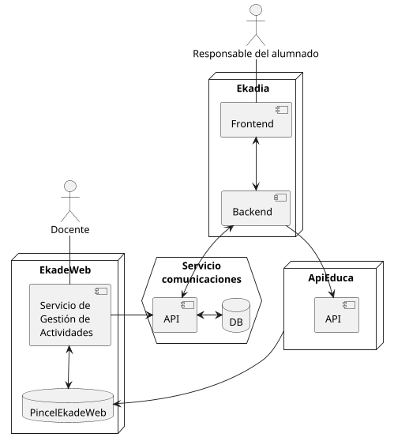
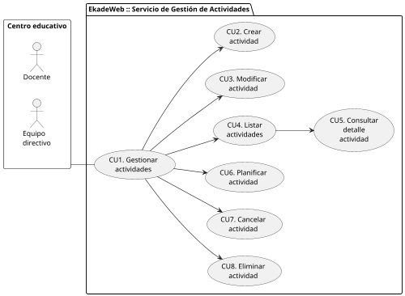
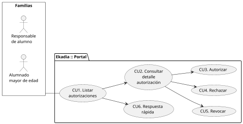
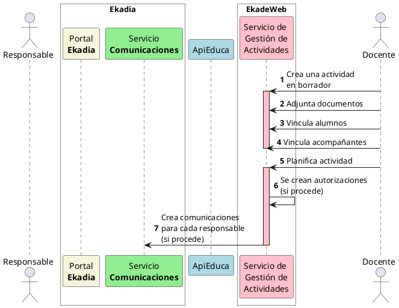
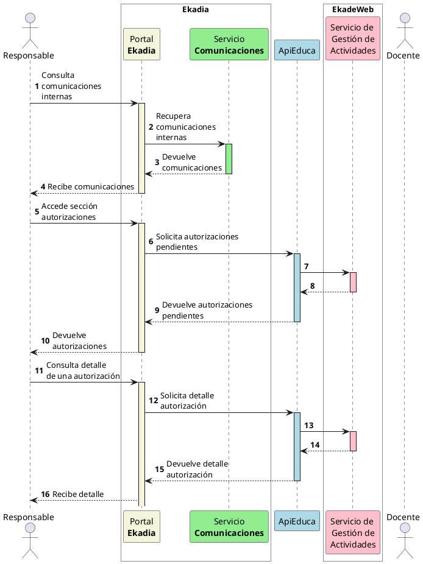
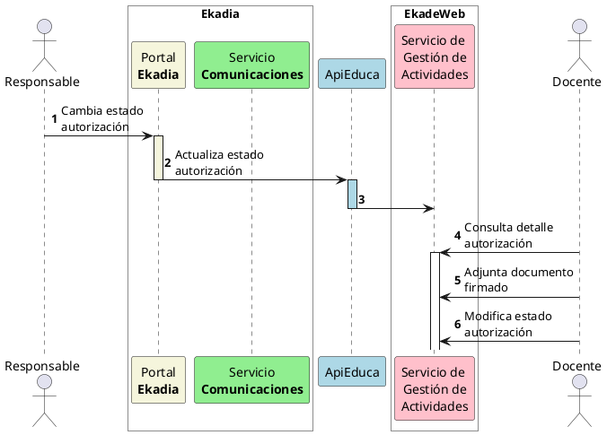
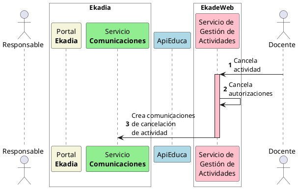
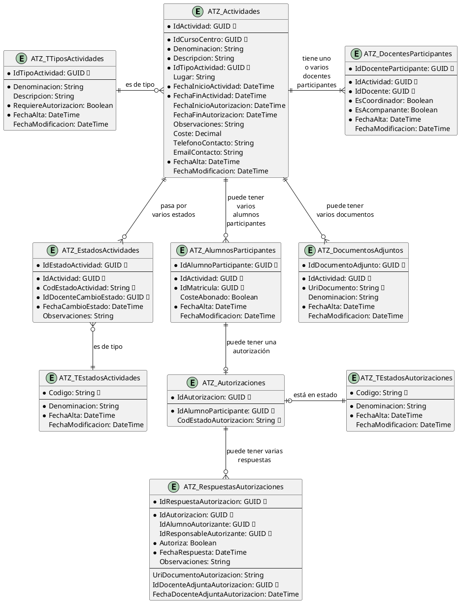
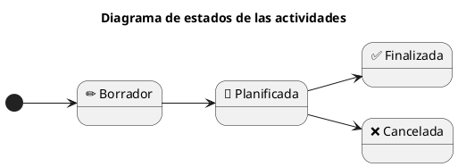

# 1. Introducción

Análisis funcional del **servicio de autorizaciones** para la gestión de autorizaciones de actividades organizadas por los centros educativos.

## 1.1 Objetivos del servicio

El **servicio de autorizaciones** tiene como objetivo principal permitir a los centros educativos gestionar las actividades realizadas en los mismos, así como, en el caso en que sea requerido, gestionar las autorizaciones del alumnado participante por parte de sus responsables (o del alumnado mayor de edad o emancipado). 

## 1.2 Arquitectura del servicio

El servicio se implementará una parte en **Ekadia** para las familias, y otra en **Pincel Ekade Web** para los centros educativos.

El siguiente diagrama muestra la arquitectura del servicio de autorizaciones, con sus distintos componentes o partes funcionales (APIs, front-ends, back-ends, bases de datos, colas de mensajes, etc.) y su relación con otros servicios del sistema:

## 1.3 Definiciones

- **Actividad**: Acción o conjunto de acciones que se llevan a cabo en un centro educativo, con el objetivo de complementar el aprendizaje del alumnado. Las actividades pueden ser de diferentes tipos, como salidas escolares, talleres, charlas, etc. Las actividades son organizadas por el centro educativo, normalmente **dentro del horario lectivo**, y con una relación directa con el currículo. Su objetivo es **complementar el aprendizaje académico** mediante experiencias educativas distintas al aula, como visitas, talleres o charlas. Ejemplos: visita a un museo, taller de reciclaje, etc.

- **Autorización**: Permiso o consentimiento que se otorga a un alumno para participar en una actividad organizada por el centro educativo. La autorización puede ser aceptada, rechazada o revocada. En caso de que la autorización sea aceptada, el alumno podrá participar en la actividad. En caso contrario, no podrá participar.

- **Solicitud de autorización**: Requerimiento que se envía a los responsables del alumnado, solicitando que comuniquen la decisión de **autorizar** o **rechazar** (**NO autorizar**) la participación de un alumno en una actividad.

- **Autorizar**: Acción de dar respuesta positiva a una solicitud de autorización para la participación de un alumno en una actividad.

- **Rechazar**: Acción de dar respuesta negativa a una solicitud de autorización para la participación de un alumno en una actividad.

- **Revocar**: Acción de anular una autorización previamente concedida para la participación de un alumno en una actividad.

- **Respuesta**: Aceptación, rechazo o revocación de una solicitud de autorización. En el caso de que la respuesta sea positiva, se considera que el responsable del alumnado ha autorizado la participación del alumno en la actividad. En caso contrario, se considera que el responsable del alumnado ha rechazado la participación del alumno en la actividad.

- **Centro educativo**: Equipo directivo y profesorado nombrado en un centro.

- **Participante**: Alumno designado para participar en una actividad.

- **Coordinador**: Docente o cargo directivo que gestiona la actividad.

- **Acompañante**: Docente responsable que acompaña al alumnado durante la actividad. Tendrá un grupo de alumnos asignado.

- **Responsable del alumnado**: padre, madre, tutor legal o guardador del alumnado en el caso de los menores de edad, y alumnado mayor de edad o emancipado.

> ℹ️ Destacar que no es lo mismo una **actividad complementaria** que una **actividad extraescolar**. La diferencia radica en que la actividad complementaria se realiza dentro del horario lectivo y está relacionada con el currículo, mientras que la actividad extraescolar se realiza fuera del horario lectivo y no necesariamente está vinculada al currículo.

# 2. Requisitos Funcionales

El **servicio de gestión de actividades** deberá cumplir con los siguientes requisitos funcionales:

## 2.1 Centro educativo

### **RF1: Creación de actividades**
  
1. Un docente podrá crear una actividad asociada al centro educativo en el que se encuentre nombrado.
2. El creador de la actividad será coordinador de la actividad (por defecto).
3. El estado inicial de la actividad será **borrador**.
4. Cada actividad podrá tener la siguiente información:

| Campo                                      | Descripción                                                                              | Ejemplo                                                                     |
| ------------------------------------------ | ---------------------------------------------------------------------------------------- | --------------------------------------------------------------------------- |
| **Identificador de la actividad**          | Identificador único de la actividad.                                                     | Generado automáticamente                                                    |
| **Centro educativo**                       | Centro educativo que organiza la actividad.                                              | `IES XYZ (38000000)`                                                        |
| **Denominación**                           | Denominación de la actividad.                                                            | `Visita al museo de ciencias naturales`                                     |
| **Descripción**                            | Texto libre descriptivo de la actividad.                                                 | Explorar y disfrutar el museo dando sentido a los contenidos trabajados ... |
| **Tipo de actividad**                      | Ver **Tipos de actividades** en el documento [5. Modelo de datos](5-modelo-de-datos.md). | `Excursión`                                                                 |
| **Lugar de realización de la actividad**   | Lugar donde se realizará la actividad.                                                   | `Museo de ciencias naturales`                                               |
| **Periodo de realización de la actividad** | Fecha/hora de comienzo y de finalización de la actividad.                                | `15 de diciembre de 2025 de 9:00 a 12:00`                                   |
| **Periodo de autorización**                | Periodo para autorizar la participación por parte de los responsables.                   | `Hasta el 14 de abril de 2025 a las 23:59`                                  |
| **Observaciones**                          | Observaciones sobre la actividad.                                                        | `No se permite el uso de móviles`                                           |
| **Coste**                                  | Coste de la actividad (si procede).                                                      | `5€`                                                                        |
| **Teléfono de contacto**                   | Teléfono de contacto con el profesorado en caso de emergencia.                           | `666 666 666`                                                               |
| **Correo electrónico de contacto**         | Correo electrónico de contacto con el profesorado en caso de emergencia.                 | `cnorris@gobiernodecanarias.org`                                            |
| **Fecha/hora creación**                    | Fecha/hora de alta de la actividad.                                                      | `10/04/2025 10:30`                                                          |
| **Fecha/hora modificación**                | Fecha/hora de última modificación de la actividad.                                       | `10/04/2025 10:30`                                                          |
| **Estado de la actividad**                 | Ver **Estados de las actividades** en el [Modelo de datos](5-modelo-de-datos.md).        | `Borrador`                                                                  |
| **Alumnos participantes**                  | Alumnado del centro que participará en la actividad.                                     | - `Alumno 1 (3ºA)` - `Alumno 2 (3ºA)` - `Alumno 3 (3ºB)`            |
| **Docentes participantes**                 | Profesorado del centro acompaña al alumnado y/o coordina en la actividad.                | - `Chuck Norris` - `Bruce Lee`                                          |
| **Documentos adjuntos**                    | Documentos que se adjuntan a la actividad (folletos, normas de comportamiento, etc.).    | `📄 Folletos informativos`                                                   |

5. La denominación de la actividad será un texto libre obligatorio.
6. La descripción de la actividad será un texto libre obligatorio (en formato Markdown).
7. El tipo de actividad deberá ser uno de los tipos de actividad definidos en el sistema y será obligatorio.
   - Dependiendo del tipo de actividad, se podrá requerir la autorización de los responsables del alumnado (ver **Tipos de actividades** en el documento [5. Modelo de datos](5-modelo-de-datos.md)).
8. El periodo de realización de la actividad (fecha/hora de inicio y fin de la actividad) será obligatorio.
9. La fecha/hora límite de autorización deberá estar comprendido entre: 
   - La fecha/hora de planificación de la actividad (se establece la actividad en estado **planificado**).
   - La fecha/hora de inicio de realización de la actividad.
10. El coste de la actividad será un número decimal y será opcional (0 si no tiene coste).
    - Si la actividad tiene coste, se deberá indicar el coste por alumno.
    - El coste de la actividad no podrá ser negativo.
11. Se podrán vincular varios docentes a la actividad como coordinadores y/o acompañantes.
    - Siempre deberá haber como mínimo un docente coordinador vinculado a la actividad.
    - Sólo se podrá vincular docentes del mismo centro educativo al que pertenece la actividad.
    - Los docentes acompañantes podrán vincularse a un grupo de alumnos.
    - Un grupo de alumnos podrá tener 0 o más docentes acompañantes.
12. La actividad podrá tener 0 o más documentos adjuntos.
13. Los alumnos participantes se vincularán a la actividad mediante su matrícula.
    - Se podrá vincular alumnos específicos.
    - Se podrá vincular grupos completos.
14. El teléfono de contacto y el correo electrónico de contacto serán opcionales.
   
### **RF2: Modificación de actividades**

1. Un coordinador o el equipo directivo podrá modificar una actividad.
2. La actividad deberá encontrarse en estado **borrador** para poder modificarla completamente.
   - Se podrán modificar todos los campos de la actividad (ver RF1).
3. Una actividad en estado **planificada** sólo podrá ser modificada de forma parcial:
   - Se podrá añadir o quitar alumnos participantes.
     - Estos cambios en una actividad planificada deberán comunicarse a los reponsables de dichos alumnos.
   - Se podrá añadir o quitar docentes coordinadores y/o acompañantes.
   - Se podrá añadir o quitar documentos adjuntos.
   - Cualquier otra modificación de la actividad (denominación, descripción, tipo de actividad, lugar de realización, periodo de realización, fecha/hora límite de autorización, coste) no será posible.
     > ❌ En caso de error en una actividad **planificada**, se deberá **cancelar** la actividad y crear una nueva, pudiendo informar del error en el motivo de la cancelación si procede (ver RF5).

### **RF3: Eliminación de actividades**
  
1. Un coordinador o el equipo directivo podrá eliminar una actividad.
2. Sólo se podrá eliminar la actividad siempre y cuando esté en estado **borrador**.
3. Se eliminará toda la información asociada a dicha actividad (adjuntos, participantes, coordinadores, acompañantes, ...).
4. Si la actividad se encuentra en otro estado, sólo podrá ser **cancelada** (ver RF5).

### **RF4: Planificación de la actividad**

1. Una actividad en estado **borrador** podrá cambiarse a estado **planificada** por un coordinador o el equipo directivo.
2. En caso de que la actividad requiera autorización, se deberá enviar una **comunicación interna** a los responsables del alumnado.
   - Se enviará una comunicación a cada uno de los responsables del alumnado (o al propio alumno mayor de edad) informando que tiene pendiente de respuesta una autorización.
   - La comunicación incluirá una **referencia a la autorización**.
   - Cada uno de los responsables de un alumno recibirá una comunicación con la misma información y referencia.
   - Cada comunicación incluirá:

| Campo                                         | Descripción                                                                                                                                                          | Ejemplo                                                                                                                                                                                                                                                                       |
| --------------------------------------------- | -------------------------------------------------------------------------------------------------------------------------------------------------------------------- | ----------------------------------------------------------------------------------------------------------------------------------------------------------------------------------------------------------------------------------------------------------------------------- |
| **Tipo de comunicación**                      | Tipo de comunicación que se envía a los responsables del alumnado.                                                                                                   | `CSAU` (comunicación de solicitud de autorización). Ver [tabla](https://www3.gobiernodecanarias.org/aplicaciones/educacion/rm/projects/gestion-administrativa-y-academica-en-los-centros-educativos-pincel-ekade/wiki/ProyectosEkadiaAnalisisComunicacionesInternas)        . |
| **Asunto**                                    | Indicando que se ha recibido una solicitud de autorización.                                                                                                          | Solicitud de autorización para la actividad "Visita al museo de ciencias naturales"                                                                                                                                                                                           |
| **Breve descripción (contenido del mensaje)** | Mensaje genérico acerca de la solicitud de autorización para la actividad.                                                                                           | Ha recibido una solicitud de autorización para la participación de "Sylvester Stallone" en la actividad "Visita al museo de ciencias naturales", que se realizará en "Museo de ciencias naturales" desde el "15/12/2025 a las 9:00" hasta el "15/12/2025 a las 12:00"         |
| **Remitente**                                 | El coordinador (o cargo directivo en su defecto) que ha planificado la actividad (que la ha cambiado a estado **planificada**) será el remitente de la comunicación. | `Chuck Norris`                                                                                                                                                                                                                                                                |
| **Destinario**                                | Responsable del alumno (o al propio alumnado mayor de edad o emancipado) del que se requiere autorización.                                                           | `Jackie Chan`                                                                                                                                                                                                                                                                 |
| **Referencia a la autorización**              | La comunicación incluirá una referencia a la autorización. Esta referencia permitirá enlazar desde Ekadia con la autorización.                                       | `[PincelEkadeWeb].ATZ_Autorizaciones.IdAutorizacion`                                                                                                                                                                                                                          |

   - ℹ️ Las comnunicaciones internas no admitirán respuestas (unidireccional).

### **RF5: Cancelación de actividades**

1. Una actividad **planificada** podrá ser **cancelada** por un coordinador o el equipo directivo.
2. Se deberá registrar el cambio de estado de la actividad:
   - Docente coordinador que la canceló.
   - Fecha/hora de la cancelación.
   - Motivo de la cancelación (en observaciones del cambio de estado).
3. La actividad cancelada ya no podrá ser modificada (quedará bloqueada).
4. Las autorizaciones asociadas a los participantes de la actividad cancelada (si las hubiere) se establecerán como **canceladas** (ya no podrán cambiar de estado por parte los responsables del alumnado).
5. Se deberá enviar una comunicación interna a cada uno de los responsables del alumnado informando de la cancelación de la actividad (y por consiguiente, de la autorización), especificando el motivo de la cancelación:
   - Cada comunicación incluirá:

| Campo                                         | Descripción                                                                                                                                                      | Ejemplo                                                                                                                                                                                                                                                 |
| --------------------------------------------- | ---------------------------------------------------------------------------------------------------------------------------------------------------------------- | ------------------------------------------------------------------------------------------------------------------------------------------------------------------------------------------------------------------------------------------------------- |
| **Tipo de comunicación**                      | Tipo de comunicación que se envía a los responsables del alumnado.                                                                                               | `CSAU`                                                                                                                                                                                                                                                  |
| **Asunto**                                    | Indicando que se ha cancelado la actividad.                                                                                                                      | Cancelación de la actividad "Visita al museo de ciencias naturales"                                                                                                                                                                                     |
| **Breve descripción (contenido del mensaje)** | Mensaje genérico indicando el motivo de la cancelación de la actividad.                                                                                          | Se ha cancelado la actividad "Visita al museo de ciencias naturales" en la que iba a participar "Sylvester Stallone", planificada en "Museo de ciencias naturales" desde el "15/12/2025 a las 9:00" hasta el "15/12/2025 a las 12:00" por "Mal tiempo". |
| **Remitente**                                 | El coordinador (o cargo directivo en su defecto) que ha cancelado la actividad (que la ha cambiado a estado **cancelada**) será el remitente de la comunicación. | `Chuck Norris`                                                                                                                                                                                                                                          |
| **Destinario**                                | Responsable del alumno (o al propio alumnado mayor de edad o emancipado) al que se quiere informar.                                                              | `Jackie Chan`                                                                                                                                                                                                                                           |
| **Referencia al alumno participante**         | La comunicación incluirá una referencia a la autorización. Esta referencia permitirá enlazar desde Ekadia con la autorización.                                   | `[PincelEkadeWeb].ATZ_Autorizaciones.IdAutorizacion`                                                                                                                                                                                                    |
   - ℹ️ Estas comnunicaciones internas no admitirán respuestas (unidireccional).
  
### **RF6: Listado de actividades**

1. Cualquier docente podrá **listar todas las actividades** de su centro educativo (excepto las que estén en estado **borrador**).
2. Un docente sólo podrá **listar las actividades** en estado **borrador** si figura como docente participante o es un cargo directivo.
3. De cada actividad se mostrará:

| Campo                                       | Descripción                                                                                            | Ejemplo                                                   |
| ------------------------------------------- | ------------------------------------------------------------------------------------------------------ | --------------------------------------------------------- |
| **Denominación**                            | Denominación de la actividad.                                                                          | `Visita al museo de ciencias naturales`                   |
| **Estado de la actividad**                  | Ver **Estados de las actividades** en el documento [5. Modelo de datos](5-modelo-de-datos.md).         | `Planificada`                                             |
| **Periodo de realización de la actividad**  | Fecha/hora de inicio y fin de la actividad.                                                            | `15/12/2025 9:00 - 12:00`                                 |
| **Tipo de actividad**                       | Ver **Tipos de actividades** en el documento [5. Modelo de datos](5-modelo-de-datos.md).               | `Excursión`                                               |
| **Requiere autorización**                   | Indica si la actividad requiere autorización de los responsables del alumnado.                         | `✅`                                                       |
| **Autorizaciones**                          | Indica las autorizaciones pendientes de respuesta (en caso de que la actividad requiera autorización). | `✅ 5 aceptadas` `❌ 2 rechazadas` `⌛ 7 pendientes` |
| **Grupos participantes**                    | Relación de grupos y cantidad de alumnosque participan en la actividad.                                | `3ºA (5), 3ºB (3), 3ºC (6)`                               |
| **Cantidad de solicitudes de autorización** | Cantidad de solicitudes de autorización enviadas y autorizadas.                                        | `Enviadas: 30, Autorizadas: 25`                           |
| **Participación**                           | Indica si el docente es coordinador y/o acompañante.                                                   | `✅ Acompañante` `❌ Coordinador`                       |

   > ℹ️ La relación de grupos participantes implica que al menos algún alumno de ese grupo participará en la actividad.

4. Las actividades se podrán **ordenar** por:
   - Fecha/hora de inicio y fin de la actividad (por defecto, en orden descendente).
   - Denominación.
5. Las actividades se podrán **agrupar** por:
   - Tipo de actividad.
   - Estado de la actividad.
6. Las actividades se podrán **filtrar** por:
   - Curso escolar (filtro por defecto).
   - Denominación.
   - Tipo de actividad.
   - Estado de la actividad.
   - Rango de fechas de realización.
7. De cada actividad se podrá consultar el detalle (ver RF7).

### **RF7: Consulta del detalle de una actividad**

1. El detalle de una activiad deberá presentar todos los datos de una actividad seleccionada (RF6):
   - Se presentarán los mismos datos que al crear la actividad (ver RF1).
   - En el listado de alumnos participantes se indicará el estado de la autorización (si procede): AUTORIZADA, RECHAZADA, PENDIENTE.
   - Un autorización se considerará pendiente cuando no figure ninguna autorización asociada al alumno participante.
2. Desde el detalle de la actividad se podrán realizar las siguientes acciones sobre la misma:
   - Planificar la actividad (ver RF4).
     - Si la actividad está en estado **borrador**, se podrá planificar la actividad.
   - Modificar la actividad (ver RF2).
     - Si la actividad está en estado **borrador**, se podrá modificar la actividad sin restricciones.
     - Si la actividad está en estado **planificada**, se podrá modificar la actividad parcialmente (ver RF2).
   - Cancelar la actividad (ver RF5).
     - Si la actividad está en estado **planificada**, se podrá cancelar la actividad.
   - Finalizar la actividad (ver RF6).
     - Si la actividad está en estado **planificada**, se podrá finalizar la actividad.
   - Exportar un informe con el listado de participantes (ver RF8).
   - Exportar un modelo de autorización de la actividad para su presentación física (ver RF9). ❗ **[casos excepcionales]**
   - Autorizar la participación de un alumno en la actividad (ver RF10).

### **RF8: Exportación del listado de participantes**

1. Se podrá exportar el listado de participantes de una actividad.
   - Esto facilitará al docente llevar un control manual de asistencia del alumnado autorizado y no autorizado durante la realización de la actividad.
2. El formato de exportación será PDF.
3. El documento incluirá un **encabezado** con los siguientes datos cumplimentados:

| Detalle                                    | Descripción                                                              | Ejemplo                                 |
| ------------------------------------------ | ------------------------------------------------------------------------ | --------------------------------------- |
| **Centro educativo**                       | Denominación y código del centro educativo.                              | `IES XYZ (38000000)`                    |
| **Denominación de la actividad**           | Denominación de la actividad.                                            | `Visita al museo de ciencias naturales` |
| **Tipo de actividad**                      | Tipo de actividad.                                                       | `Excursión`                             |
| **Periodo de realización de la actividad** | Fecha/hora de inicio y fin de la actividad.                              | `15/12/2025 9:00 - 15/12/2025 12:00`    |
| **Cantidad de docentes acompañantes**      | Total de profesores acompañantes.                                        | `Docentes: 5`                           |
| **Cantidad de alumnos participantes**      | Total de alumnos autorizados y convocados.                               | `Autorizados: 25 de 30`                 |
| **Grupos participantes**                   | Relación de grupos y cantidad de alumnos que participan en la actividad. | `3ºA (5), 3ºB (12), 3ºC (7)`            |

   > ℹ️ En caso de que la actividad no requiera autorización, autorizados y convocados serán los mismos.

4. El documento incluirá en el **cuerpo** los siguientes datos cumplimentados:
   - **Listado de profesorado** acompañante.
   - **Listado de alumnado** participante agrupado por grupo, indicando por cada alumno:
     - Nombre y apellidos.
     - Si está autorizado o no (si procede).
     - Si ha abonado el coste de la actividad (si procede).
     - Si hay algún comentario o circunstancia de interés especial informada por el responsable en la autorización.
     - Espacio para que el docente pueda marcar la asistencia del alumnado.
   - **Listado de alumnado con observaciones** en la autorización.
     - Nombre y apellidos del alumno.
     - Observaciones informadas por el responsable en la autorización.
5. El documento incluirá un **pie de página** con los siguientes datos cumplimentados:   
   - Incluirá la fecha/hora de exportación del listado.
   - Si la actividad está en estado **borrador**, se indicará que el listado es provisional.

### **RF9: Exportación del modelo de autorización**

1. Se podrá exportar un modelo de autorización para aquellas actividades que por su tipología lo requieran.
   - Esto permitirá en casos excepcionales que un responsable firme la autorización en formato físico (papel).
2. El formato de exportación será en PDF.
3. El documento incluirá un **encabezado** con los siguientes datos cumplimentados:

| Detalle                                              | Descripción                                                              | Ejemplo                                 |
| ---------------------------------------------------- | ------------------------------------------------------------------------ | --------------------------------------- |
| **Centro educativo**                                 | Denominación y código del centro educativo.                              | `IES XYZ (38000000)`                    |
| **Denominación de la actividad**                     | Denominación de la actividad.                                            | `Visita al museo de ciencias naturales` |
| **Descripción de la actividad**                      | Descripción de la actividad.                                             | `El alumnado de 3º de primaria ...`     |
| **Periodo de realización de la actividad**           | Fecha/hora de inicio y fin de la actividad.                              | `15/12/2025 9:00 - 15/12/2025 12:00`    |
| **Cantidad de docentes acompañantes**                | Total de profesores acompañantes.                                        | `Docentes: 5`                           |
| **Cantidad de alumnos participantes**                | Total de alumnos convocados.                                             | `30`                                    |
| **Grupos participantes**                             | Relación de grupos y cantidad de alumnos que participan en la actividad. | `3ºA (5), 3ºB (15), 3ºC (10)`           |
| **Coordinador de la actividad**                      | Nombre y apellidos del coordinador de la actividad.                      | `Chuck Norris`                          |
| **Teléfono de contacto para emergencias**            | Teléfono de contacto del coordinador de la actividad.                    | `666 666 666`                           |
| **Dirección de correo de contacto para emergencias** | Teléfono de contacto del coordinador de la actividad.                    | `cnorris@gobcan.es`                     |

4. El documento incluirá en el **cuerpo** espacio para los siguientes datos:
   - Nombre y apellidos del responsable del alumnado que firma la autorización.
   - Nombre y apellidos del alumno.
   - Dirección del responsable del alumno.
   - Teléfono de contacto del responsable del alumno.
   - Circunstancias de interés especial: enfermedad, alergias, etc. (observaciones).
   - DNI y firma del responsable del alumno.
   - DNI y firma del alumno mayor de edad o emancipado.
5. El documento incluirá un **pie de página** con los siguientes datos cumplimentados:   
   - Incluirá la fecha/hora de exportación del modelo.
   - Si la actividad está en estado **borrador**, se indicará que el modelo es provisional.

|        |
| ------------------------------------------------ |
| *Ejemplo de modelo de solicitud de autorización* |

### **RF10: Autorización de la participación de un alumno en la actividad (autorización manual)**

1. Un coordinador o un cargo directivo podrá establecer como autorizada la participación de un alumno en la actividad.
   - Deberá encontrarse la actividad en estado **planificada**.
2. Deberá indicar el responsable del alumno que ha firmado la autorización.
   - Se podrá seleccionar entre los responsables del alumno que figuran en el sistema.
3. Deberá adjuntar copia del documento de autorización firmado por el responsable del alumno.
4. El estado de la autorización del alumno pasará a estar en estado **autorizada**.

## 2.2 Responsables del alumnado

### **RF11: Recepción de comunicaciones de autorizaciones pendientes**

1. Los responsables recibirán una comunicación interna donde se les notifica que tienen una autorización pendiente de un alumno del que son responsables.
2. La comunicación recibida incluirá la información indicada en RF4.2.
   - Destacar que la comunicación incluirá una **referencia al alumno participante** en el servicio de autorizaciones.
   - Esta referencia permitirá enlazar desde Ekadia con el detalle de la actividad (ver RF13).
3. La comunicación no admitirá respuestas (unidireccional).
> ℹ️ Se deberá autorizar de forma individual por alumno, ya que se puede ser responsable de varios alumnos que participen en la misma actividad, y habrá que autorizar a cada uno de ellos por separado.

### **RF12: Listado de autorizaciones**

1. Los responsables podrán listar las autorizaciones:
   - Se listarán las autorizaciones pendientes de respuesta y las autorizaciones con respuesta.
   - Se listarán las autorizaciones de los alumnos de los que son responsables (o el propio alumno mayor de edad o emancipado). 
2. El listado de autorizaciones mostrará la siguiente información:

| Centro educativo           | Descripción                           | Tipo de actividad | Periodo de realización  | Periodo de firma                               | Alumno             | Responsable | Estado                                                             |
| -------------------------- | ------------------------------------- | ----------------- | ----------------------- | ---------------------------------------------- | ------------------ | ----------- | ------------------------------------------------------------------ |
| `IES XYZ` `(38000000)` | Visita al museo de ciencias naturales | `Excursión`       | `15/12/2025 9:00-12:00` | `10/04/2025 0:00` - `14/04/2025 23:59` | Sylvester Stallone | Jackie Chan | `⌛Pendiente` `✅Autorizado` `❌No autorizado` `Caducada` |

   - Se mostrará el responsable que respondió a la autorización o vacío si está pendiente de respuesta.
   - Las autorizaciones pendientes fuera de plazo de autorización se mostrarán como **caducadas**.
3. El listado se podrá **agrupar** por:
   - Estado de la autorización.
   - Alumno (matrícula) (por defecto).
4. El listado se podrá **filtrar** por:
   - Estado de la autorización (activa por defecto).
   - Centro educativo
   - Tipo de actividad.
   - Rango de fechas de realización.
5. El listado se ordenará en orden descendente por fecha de recepción de la solicitud.
6. Se ofrecerán las siguientes acciones:
   - Consultar el detalle de la autorización (ver RF13).
   - Autorizar o rechazar la participación de un alumno en una actividad (ver RF12).

### **RF13: Consulta del detalle de las autorizaciones**

1. Los responsables podrán consultar el detalle de una solicitud de autorización.
2. La referencia de las comunicaciones internas enviadas a los responsables permitirá consultar o acceder a este detalle directamente (ver RF11.2).
3. El detalle de una solicitud de autorización deberá incluir:

| Detalle                       | Descripción                                                                                      | Ejemplo                                                                                                                                                                      |
| ----------------------------- | ------------------------------------------------------------------------------------------------ | ---------------------------------------------------------------------------------------------------------------------------------------------------------------------------- |
| **Asunto**                    | Denominación de la actividad                                                                     | `Visita al museo de ciencias naturales`                                                                                                                                      |
| **Descripción**               | Descripción de la actividad                                                                      | El alumnado de 3º de primaria realizará una visita al museo de ciencias naturales el día 15 de diciembre de 2025, de 9:00 a 12:00 horas. La actividad tendrá un coste de 5€. |
| **Documentos adjuntos**       | Documentos adjuntos a la solicitud                                                               | `Folleto informativo de la actividad (JPG)` `Normas de comportamiento durante la actividad (PDF)`                                                                        |
| **Periodo de la actividad**   | Periodo de realización de la actividad                                                           | `Desde 5/5/2025 9:00` - `Hasta 5/5/2025 13:00`                                                                                                                               |
| **Periodo de autorización**   | Periodo en que se puede dar respuesta a la autorización por parte de los responsables del alumno | `Desde 10/4/2025 0:00` - `Hasta 14/4/2025 23:59`                                                                                                                             |
| **Estado de la autorización** | Última respuesta de la autorización.                                                             | `⌛Pendiente` `✅Autorizado` `❌No autorizado` `Caducada`                                                                                                           |
| **Responsable que autorizó**  | Nombre y apellidos del responsable que dio la última respuesta a la autorización                 | `Jackie Chan`                                                                                                                                                                |

4. Se podrán descargar los adjuntos para su consulta.
5. Desde el detalle de la autorización se podrán realizar las siguientes acciones:
   - Autorizar o rechazar la participación de un alumno en una actividad (ver RF14) dentro de plazo.
   - Revocar autorización (ver RF15). 
     > ⚠️ ¡Funcionalidad pendiente para futuras versiones!

### **RF14: Autorización o rechazo de la participación de un alumno en una actividad** 

1. Los responsables podrán autorizar o rechazar (NO autorizar) una autorización de participación.
2. Las posibles respuestas son: **autorizo**, **no autorizo**.
3. Podrán especificar observaciones o circunstancias de interés especial (en caso de autorización).
   - Estas observaciones se mostrarán en el listado de participantes de la actividad (ver RF8).
4. Podrán hacerlo desde la vista de detalle de la autorización (ver RF13) y desde el listado de autorizaciones (acción rápida) (ver RF12.6).
5. Sólo se podrá autorizar o rechazar una autorización si está en periodo de firma.
6. Cada vez que un responsable cambie el estado de la autorización, se registrará la fecha y el responsable que realizó el cambio.
7. Concluido el plazo de autorización de la actividad, un responsable ya no podrá cambiar el estado de la autorización.

### **RF15: Revocación de una autorización** 

> ⚠️ ¡Funcionalidad pendiente para futuras versiones!

1. Una autorización podrá ser revocada por alguno de los responsables del alumnado (o alumno mayor de edad o emancipado).
2. Podrán hacerlo desde la vista de detalle de la autorización.
3. Sólo se podrá revocar una solicitud de autorización si está en estado **autorizada**, fuera del plazo de autorización y previo a la realización de la actividad.
   - Si la actividad no se ha realizado, se podrá revocar la autorización.
   - Si la actividad ya se ha realizado, no se podrá revocar la autorización.
4. El responsable y la fecha de revocación quedarán registrados.
5. Al tratarse de una acción irreversible, se deberá solicitar confirmación al responsable del alumnado antes de proceder a la revocación de la autorización.

# 3. Casos de uso

Los casos de uso del **servicio de autorizaciones** son los siguientes:

## 3.1 EkadeWeb: Docentes y equipos directivos

| CU1                 | Gestionar actividades                                                                                                               |
| ------------------- | ----------------------------------------------------------------------------------------------------------------------------------- |
| **Actores**         | Equipo directivo, Profesorado                                                                                                       |
| **Descripción**     | Los docentes de un centro educativo podrán gestionar las actividades.                                                               |
| **Precondiciones**  | El docente debe encontrarse nombrado en un centro educativo.                                                                        |
| **Flujo principal** | 1. El usuario accede a la aplicación como docente o cargo directivo.                                                                |
|                     | 2. Selecciona el centro educativo (nombramiento).                                                                                   |
|                     | 3. Accede a la sección de actividades.                                                                                              |
|                     | 4. Podrá crear (CU2), modificar (CU3), listar (CU4), eliminar (CU5), planificar (CU6), cancelar (CU7) o eliminar (CU8) actividades. |
| **Postcondiciones** |                                                                                                                                     |

| CU2                 | Crear actividad                                                          |
| ------------------- | ------------------------------------------------------------------------ |
| **Actores**         | Equipo directivo, Profesorado                                            |
| **Descripción**     | Los docentes de un centro educativo podrán crear actividades.            |
| **Precondiciones**  | El usuario debe encontrarse nombrado en un centro educativo.             |
| **Flujo principal** | 1. El usuario accede a la aplicación.                                    |
|                     | 2. Selecciona el centro educativo.                                       |
|                     | 3. Crea una nueva actividad.                                             |
|                     | 4. Completa los datos de la actividad.                                   |
|                     | 5. Establece el tipo de actividad.                                       |
|                     | 6. Define el perido de autorización (si procede).                        |
|                     | 7. Vincula alumnos participantes a la actividad                          |
|                     | 8. Vincula docentes acompañantes o coordinadores.                        |
|                     | 9. Adjunta documentos a la solicitud.                                    |
|                     | 10. Guarda la actividad como borrador o guarda y planifica la actividad. |
| **Postcondiciones** | La actividad ha sido creada.                                             |

| CU3                   | Modificar actividad                                                                                                                                                     |
| --------------------- | ----------------------------------------------------------------------------------------------------------------------------------------------------------------------- |
| **Actores**           | Equipo directivo, Profesorado                                                                                                                                           |
| **Descripción**       | Los docentes de un centro educativo podrán editar actividades.                                                                                                          |
| **Precondiciones**    | El usuario debe encontrarse nombrado en un centro educativo.                                                                                                            |
|                       | El usuario debe ser cargo directivo o coordinador para editarla.                                                                                                        |
|                       | La actividad debe encontrarse en estado **borrador**.                                                                                                                   |
| **Flujo principal**   | 1. El usuario accede a la aplicación.                                                                                                                                   |
|                       | 2. Selecciona el centro educativo.                                                                                                                                      |
|                       | 3. Lista las actividades del centro educativo.                                                                                                                          |
|                       | 4. Editar una actividad existente.                                                                                                                                      |
|                       | 5. Establece el tipo de actividad.                                                                                                                                      |
|                       | 6. Define el perido de autorización (si procede).                                                                                                                       |
|                       | 6. Vincula alumnos participantes a la actividad                                                                                                                         |
|                       | 7. Vincula docentes acompañantes o coordinadores.                                                                                                                       |
|                       | 8. Adjunta documentos a la solicitud.                                                                                                                                   |
|                       | 9. Guarda la actividad la actividad.                                                                                                                                    |
| **Flujo alternativo** | 4a. Si la actividad se encuentra en estado **planificicada**, el usuario no podrá editarla completamente.                                                               |
|                       | 6a. Podrá vincular/desvincular alumnos participantes.                                                                                                                   |
|                       | 7a. Podrá vincular/desvincular docentes acompañantes o coordinadores.                                                                                                   |
|                       | 9a. Si la actividad se encuentra **planificada**, añadir/quitar alumnos participantes implicará la generación de nuevas autorizaciones o cancelación de las existentes. |
| **Postcondiciones**   | La actividad ha sido modificada.                                                                                                                                        |

| CU4                 | Listar actividades                                                                                                        |
| ------------------- | ------------------------------------------------------------------------------------------------------------------------- |
| **Actores**         | Equipo directivo, Profesorado                                                                                             |
| **Descripción**     | Los docentes de un centro educativo podrán listar las actividades del centro.                                             |
| **Precondiciones**  | El usuario debe encontrarse nombrado en un centro educativo.                                                              |
|                     | Si la actividad se encuentra en estado **borrador**, solo el coordinador de la misma o un cargo directivo podrá listarla. |
| **Flujo principal** | 1. El usuario accede a la aplicación.                                                                                     |
|                     | 2. Selecciona el centro educativo.                                                                                        |
|                     | 3. Lista las actividades del centro educativo.                                                                            |
|                     | 3a. Se ocultarán las actividad en estado **borrador** si no se es cargo directivo o coordinador de la misma.              |
|                     | 4. Podrá filtrar las actividades por denominación, tipo, estado, periodo de realización.                                  |
|                     | 5. Podrá agrupar las actividades por tipo, estado.                                                                        |
| **Postcondiciones** | Las actividades han sido listadas.                                                                                        |

| CU5                 | Consultar detalle de una actividad                                                                                      |
| ------------------- | ----------------------------------------------------------------------------------------------------------------------- |
| **Actores**         | Equipo directivo, Profesorado                                                                                           |
| **Descripción**     | Los docentes de un centro educativo podrán consultar el detalle de una actividad.                                       |
| **Precondiciones**  | El usuario debe encontrarse nombrado en un centro educativo.                                                            |
|                     | Si la actividad se encuentra en estado **borrador**, solo los coordinadores y los cargos directivos podrán consultarla. |
| **Flujo principal** | 1. El usuario accede a la aplicación.                                                                                   |
|                     | 2. Selecciona el centro educativo.                                                                                      |
|                     | 3. Lista las actividades del centro educativo.                                                                          |
|                     | 4. Selecciona consultar una actividad del listado.                                                                      |
| **Postcondiciones** | El detalle de la actividad ha sido consultado.                                                                          |

| CU6                 | Planificar una  actividad                                                           |
| ------------------- | ----------------------------------------------------------------------------------- |
| **Actores**         | Equipo directivo, Profesorado                                                       |
| **Descripción**     | Los docentes de un centro educativo podrán planificar una actividad.                |
| **Precondiciones**  | El usuario debe encontrarse nombrado en un centro educativo.                        |
|                     | La actividad debe encontrarse en estado **borrador**.                               |
|                     | Solo los coordinadores de la actividad y los cargos directivos podrán planificarla. |
| **Flujo principal** | 1. El usuario accede a la aplicación.                                               |
|                     | 2. Selecciona el centro educativo.                                                  |
|                     | 3. Lista las actividades del centro educativo.                                      |
|                     | 4. Selecciona y consulta el detalle de una actividad del listado.                   |
|                     | 5. Planifica la actividad desde el detalle (requiere confirmación).                 |
|                     | 6. Confirma la planificación de la actividad.                                       |
| **Postcondiciones** | La actividad ha sido planificada.                                                   |
|                     | Se han enviado comunicaciones a los responsables del alumnado participante.         |

| CU7                 | Cancelar una actividad                                                            |
| ------------------- | --------------------------------------------------------------------------------- |
| **Actores**         | Equipo directivo, Profesorado                                                     |
| **Descripción**     | Los docentes de un centro educativo podrán planificar una actividad.              |
| **Precondiciones**  | El usuario debe encontrarse nombrado en un centro educativo.                      |
|                     | La actividad debe encontrarse en estado **planificada**.                          |
|                     | Solo los coordinadores de la actividad y los cargos directivos podrán cancelarla. |
| **Flujo principal** | 1. El usuario accede a la aplicación.                                             |
|                     | 2. Selecciona el centro educativo.                                                |
|                     | 3. Lista las actividades del centro educativo.                                    |
|                     | 4. Selecciona y consulta el detalle de una actividad del listado.                 |
|                     | 5. Cancela la actividad (requiere confirmación).                                  |
|                     | 6. Especifica el motivo de la cancelación.                                        |
|                     | 7. Confirma la cancelación de la actividad.                                       |
| **Postcondiciones** | La actividad ha sido cancelada.                                                   |
|                     | Se han enviado comunicaciones a los responsables del alumnado participante.       |

| CU8                 | Eliminar una actividad                                                            |
| ------------------- | --------------------------------------------------------------------------------- |
| **Actores**         | Equipo directivo, Profesorado                                                     |
| **Descripción**     | Los docentes de un centro educativo podrán planificar una actividad.              |
| **Precondiciones**  | El usuario debe encontrarse nombrado en un centro educativo.                      |
|                     | La actividad debe encontrarse en estado **borrador**.                             |
|                     | Solo los coordinadores de la actividad y los cargos directivos podrán eliminarla. |
| **Flujo principal** | 1. El usuario accede a la aplicación.                                             |
|                     | 2. Selecciona el centro educativo.                                                |
|                     | 3. Lista las actividades del centro educativo.                                    |
|                     | 4. Selecciona y consulta el detalle de una actividad del listado.                 |
|                     | 5. Elimina la actividad.                                                          |
|                     | 6. Confirma la eliminación de la actividad.                                       |
| **Postcondiciones** | La actividad ha sido eliminada                                                    |
|                     | Sus documentos adjuntos han sido eliminados.                                      |

## 3.2 Ekadia: Responsables del alumnado

| CU1                 | Listar autorizaciones                                                                                                         |
| ------------------- | ----------------------------------------------------------------------------------------------------------------------------- |
| **Actores**         | Responsable de alumno, Alumno mayor de edad                                                                                   |
| **Descripción**     | Listar y filtrar las autorizaciones .                                                                                         |
| **Precondiciones**  | El responsable debe tener derecho a información sobre el alumno.                                                              |
| **Flujo principal** | 1. El usuario accede a la aplicación.                                                                                         |
|                     | 2. Selecciona al alumno.                                                                                                      |
|                     | 3. Accede al panel de autorizaciones.                                                                                         |
|                     | 4. Filtra las autorizaciones por alumno y/o por estado  (por defecto saldrán pendientes, no caducadas, de todos sus alumnos). |
|                     | 5. Lista las autorizaciones pendientes, autorizadas, rechazadas o revocadas.                                                  |
| **Postcondiciones** | Se han listado las autorizaciones.                                                                                            |

| CU2                 | Consultar detalle de autorización                                |
| ------------------- | ---------------------------------------------------------------- |
| **Actores**         | Responsable de alumno, Alumno mayor de edad                      |
| **Descripción**     | Consultar el detalle de una autorización.                        |
| **Precondiciones**  | El responsable debe tener derecho a información sobre el alumno. |
| **Flujo principal** | 1. El usuario accede a la aplicación.                            |
|                     | 2. Selecciona al alumno.                                         |
|                     | 3. Accede al panel de autorizaciones.                            |
|                     | 4. Lista las autorizaciones.                                     |
|                     | 5. Consulta el detalle de la autorización.                       |
| **Postcondiciones** | Se han consultado el detalle de la autorización.                 |

| CU3                 | Autorizar                                                               |
| ------------------- | ----------------------------------------------------------------------- |
| **Actores**         | Responsable de alumno, Alumno mayor de edad                             |
| **Descripción**     | Autorizar una solicitud de autorización.                                |
| **Precondiciones**  | El responsable debe tener derecho a información sobre el alumno.        |
|                     | La fecha/hora actual debe encontrarse dentro del plazo de autorización. |
| **Flujo principal** | 1. El usuario accede a la aplicación.                                   |
|                     | 2. Selecciona al alumno.                                                |
|                     | 3. Accede al panel de autorizaciones.                                   |
|                     | 4. Lista las autorizaciones.                                            |
|                     | 5. Consulta el detalle de la autorización.                              |
|                     | 6. Puede especificar observaciones acerca de la autorización.           |
|                     | 7. Autoriza la autorización.                                            |
| **Postcondiciones** | Se ha autorizado la solicitud de autorización.                          |

| CU4                 | Rechazar                                                                            |
| ------------------- | ----------------------------------------------------------------------------------- |
| **Actores**         | Responsable de alumno, Alumno mayor de edad                                         |
| **Descripción**     | Rechazar una solicitud de autorización.                                             |
| **Precondiciones**  | El responsable debe tener derecho a información sobre el alumno.                    |
|                     | La fecha/hora actual debe encontrarse dentro del plazo de autorización.             |
| **Flujo principal** | 1. El usuario accede a la aplicación.                                               |
|                     | 2. Selecciona al alumno.                                                            |
|                     | 3. Accede al panel de autorizaciones.                                               |
|                     | 4. Lista las autorizaciones.                                                        |
|                     | 5. Consulta el detalle de la autorización.                                          |
|                     | 6. Puede especificar observaciones acerca del motivo de rechazo de la autorización. |
|                     | 7. Rechaza la autorización.                                                         |
| **Postcondiciones** | Se ha rechazado la solicitud de autorización.                                       |

| CU5                 | Revocar                                                                                       |
| ------------------- | --------------------------------------------------------------------------------------------- |
| **Actores**         | Responsable de alumno, Alumno mayor de edad                                                   |
| **Descripción**     | Rechazar una solicitud de autorización.                                                       |
| **Precondiciones**  | El responsable debe tener derecho a información sobre el alumno.                              |
|                     | La autorización debe estar en estado **autorizada**.                                          |
|                     | Le fecha/hora actual está entre el fin del plazo de autorización y el inicio de la actividad. |
| **Flujo principal** | 1. El usuario accede a la aplicación.                                                         |
|                     | 2. Selecciona al alumno.                                                                      |
|                     | 3. Accede al panel de autorizaciones.                                                         |
|                     | 4. Lista las autorizaciones.                                                                  |
|                     | 5. Consulta el detalle de la autorización.                                                    |
|                     | 6. Puede especificar observaciones acerca del motivo de revocación de la autorización.        |
|                     | 7. Revoca la autorización.                                                                    |
| **Postcondiciones** | Se ha revocado la solicitud de autorización.                                                  |

| CU6                 | Respuesta rápida                                                        |
| ------------------- | ----------------------------------------------------------------------- |
| **Actores**         | Responsable de alumno, Alumno mayor de edad                             |
| **Descripción**     | Autorizar una solicitud de autorización.                                |
| **Precondiciones**  | El responsable debe tener derecho a información sobre el alumno.        |
|                     | La fecha/hora actual debe encontrarse dentro del plazo de autorización. |
|                     | El responsable no considera necesario especificar observacviones.       |
| **Flujo principal** | 1. El usuario accede a la aplicación.                                   |
|                     | 2. Selecciona al alumno.                                                |
|                     | 3. Accede al panel de autorizaciones.                                   |
|                     | 4. Lista las autorizaciones.                                            |
|                     | 5. Autoriza la solicitud de autorización directamente desde el listado. |
| **Postcondiciones** | Se ha autorizado la solicitud de autorización.                          |

# 4. Flujos de trabajo

> ℹ️ Por simplicidad se han omitido de los diagramas la subida de documentos al Gestor Documental.

## FT1. Creación de una autorización

Un docente crea una actividad (coordinador) a través del portal Ekade Web, a la que podrá adjuntar documentos y vincular participantes (alumnos mediante sus matrículas) y profesores acompañantes. Una vez definida la actividad (que estará en estado **borrador**), se podrá establecer como **planificada**, generándose (si procede) una solicitud de autorización por cada participante, y una comunicación interna dirigida a cada uno de los responsables del alumno notificando que tienen autorización pendiente.

## FT2. Acceder al detalle de una autorización

El responsable del alumno podrá acceder a la autorización de dos formas diferentes en Ekadia:

a) Desde la **comunicación interna**.
b) Desde la **sección de Autorizaciones**, donde podrá seleccionar la autorización pendiente.

## FT3. Autorizar, rechazar o revocar una autorización

Una vez consultado el detalle de la autorización, el responsable podrá autorizarla, rechazarla o revocarla, siempre que la autorización se encuentre en periodo de autorización.

Igualmente, los coordinadores de una actividad podrán actualizar el estado de una autorización desde el portal Ekade Web en caso de que se reciba una autorización en formato físico (no digital) y se quiera registrar la autorización en el sistema.

## FT4. Cancelación de una actividad (opcional)

El docente que creó una actividad (organizador) podrá cancelarla desde el portal Ekade Web. La cancelación de la actividad generará una comunicación interna a los responsables del alumnado informando de la cancelación de la actividad, y cancelándose las solicitudes asociadas a la autorización (ya no serán válidas).

# 5. Modelo de datos

El modelo de datos del servicio de autorizaciones debe ser capaz de gestionar todo tipo de autorizaciones para actividades complementarias y extraescolares que se puedan solicitar a los responsables del alumnado. Es por esto que la entidad principal del servicio serán las actividades, gestionadas por personal docente o cargos directivos. Las actividades permitirán servir de agrupación para las autorizaciones.

## 5.1 Prefijo

Las entidades se crearán en la base de datos `PincelEkadeWebDB` con el prefijo `ATZ`.

> ℹ️ El prefijo `AUT` ya está asociado a la **Autorización de estudios a centros docentes** (según [GesApli](https://intranet.educacion.org/educacion/SINFO/GesApli/diccionario/detallePrefijo/3321)).

## 5.2 Entidades

### 5.2.1 Actividades (`ATZ_Actividades`)

Las actividades son los eventos que se organizan en el centro educativo y que pueden requerir autorización. 

| Clave primaria | Campo                     | Descripción                                                       | Requerido | Clave foránea                                      |
| -------------- | ------------------------- | ----------------------------------------------------------------- | --------- | -------------------------------------------------- |
| 🔑              | `IdActividad`             | Identificador único de la actividad.                              | ✅         |                                                    |
|                | `IdCursoCentro`           | Identificador del centro educativo en un curso escolar.           | ✅         | `[PincelSinkroDB].XCE_CursosCentros.IdCursoCentro` |
|                | `Denominacion`            | Nombre de la actividad.                                           | ✅         |                                                    |
|                | `Descripcion`             | Descripción de la actividad.                                      | ✅         |                                                    |
|                | `IdTipoActividad`         | Tipo de actividad.                                                | ✅         | `ATZ_TTiposActividades.IdTipoActividad`            |
|                | `Lugar`                   | Lugar donde se realiza la actividad.                              | ❌         |                                                    |
|                | `FechaInicioActividad`    | Fecha y hora de inicio de la actividad.                           | ✅         |                                                    |
|                | `FechaFinActividad`       | Fecha y hora de fin de la actividad.                              | ✅         |                                                    |
|                | `FechaInicioAutorizacion` | Fecha y hora de inicio para presentar la autorización.            | ❌         |                                                    |
|                | `FechaFinAutorizacion`    | Fecha y hora límite para presentar la autorización.               | ❌         |                                                    |
|                | `Observaciones`           | Observaciones sobre la actividad.                                 | ❌         |                                                    |
|                | `Coste`                   | Coste de la actividad.                                            | ❌         |                                                    |
|                | `TelefonoContacto`        | Teléfono de contacto para los responsables en caso de emergencia. | ❌         |                                                    |
|                | `EmailContacto`           | Email de contacto para los responsables.                          | ❌         |                                                    |
|                | `FechaAlta`               | Fecha de creación de la actividad.                                | ✅         |                                                    |
|                | `FechaModificacion`       | Fecha de modificación de la actividad.                            | ❌         |                                                    |

### 5.2.2 Estados de las actividades (`ATZ_EstadosActividades`)

Los estados de las actividades permiten conocer el estado actual de una actividad, así como los estados por los que ha pasado a lo largo de su ciclo de vida.

| Clave primaria | Campo                   | Descripción                                     | Requerido | Clave foránea                                                     |
| -------------- | ----------------------- | ----------------------------------------------- | --------- | ----------------------------------------------------------------- |
| 🔑              | `IdEstadoActividad`     | Identificador único del estado de la actividad. | ✅         |
|                | `IdActividad`           | Identificador de la actividad.                  | ✅         | `ATZ_Actividades.IdActividad`                                     |
|                | `CodEstadoActividad`    | Código del estado de la actividad.              | ✅         | `ATZ_TEstadosActividades.Codigo`                                  |
|                | `IdDocenteCambioEstado` | Identificador del docente que cambia el estado. | ✅         | `[PincelSinkroDB].XDO_DocentesCursosCentros.IdDocenteCursoCentro` |
|                | `FechaCambioEstado`     | Fecha y hora del cambio de estado.              | ✅         |                                                                   |

### 5.2.3 Alumno participantes (`ATZ_AlumnosParticipantes`)

Alumnos que participan en la actividad. Se vinculan a la actividad por medio el identificador de su matrícula.

| Clave primaria | Campo                  | Descripción                                                       | Requerido | Clave foránea                                |
| -------------- | ---------------------- | ----------------------------------------------------------------- | --------- | -------------------------------------------- |
| 🔑              | `IdAlumnoParticipante` | Identificador único del alumno participante.                      | ✅         |                                              |
|                | `IdActividad`          | Identificador de la actividad.                                    | ✅         | `ATZ_Actividades.IdActividad`                |
|                | `IdMatricula`          | Identificador de la matrícula del alumno.                         | ✅         | `[PincelSinkroDB].XMA_Matricula.IdMatricula` |
|                | `CosteAbonado`         | Indica si el coste de la actividad ha sido abonado por el alumno. | ❌         |                                              |
|                | `FechaAlta`            | Fecha y hora de vinculación del participante a la actividad.      | ✅         |                                              |
|                | `FechaModificacion`    | Fecha y hora de modificación de la vinculación.                   | ❌         |                                              |

> ℹ️ Si la actividad no tiene coste, el campo `CosteAbonado` se dejará a vacío.

### 5.2.4 Docentes participantes (`ATZ_DocentesParticipantes`)

Los docentes vinculados a una actividad pueden ser coordinadores y/o acompañantes. Como coordinador, un docente podrá gestionar una actividad. 

| Clave primaria | Campo                   | Descripción                                                     | Requerido | Clave foránea                                                     |
| -------------- | ----------------------- | --------------------------------------------------------------- | --------- | ----------------------------------------------------------------- |
| 🔑              | `IdDocenteParticipante` | Identificador único del docente participante.                   | ✅         |                                                                   |
|                | `IdActividad`           | Identificador de la actividad.                                  | ✅         | `ATZ_Actividades.IdActividad`                                     |
|                | `IdDocente`             | Identificador del docente.                                      | ✅         | `[PincelSinkroDB].XDO_DocentesCursosCentros.IdDocenteCursoCentro` |
|                | `EsCoordinador`         | Indica si el participante es coordinador.                       | ✅         |                                                                   |
|                | `EsAcompanante`         | Indica si el participante es acompañante.                       | ✅         |                                                                   |
|                | `FechaAlta`             | Fecha y hora de alta de vinculación del docente a la actividad. | ✅         |                                                                   |
|                | `FechaModificacion`     | Fecha y hora de modificación de la vinculación.                 | ❌         |                                                                   |

### 5.2.5 Documentos adjuntos (`ATZ_DocumentosAdjuntos`)

Documentos adjuntos a una actividad.

| Clave primaria | Campo                | Descripción                                 | Requerido | Clave foránea                 |
| -------------- | -------------------- | ------------------------------------------- | --------- | ----------------------------- |
| 🔑              | `IdDocumentoAdjunto` | Identificador único del documento adjunto.  | ✅         |                               |
|                | `IdActividad`        | Identificador de la actividad.              | ✅         | `ATZ_Actividades.IdActividad` |
|                | `UriDocumento`       | URI del documento adjunto.                  | ✅         | `[Gestor Documental]`         |
|                | `Denominacion`       | Denominación del documento adjunto.         | ❌         |                               |
|                | `FechaAlta`          | Fecha y hora de alta del documento.         | ✅         |                               |
|                | `FechaModificacion`  | Fecha y hora de modificación del documento. | ❌         |                               |

### 5.2.6 Autorizaciones (`ATZ_Autorizaciones`)

Las autorizaciones son los consentimientos otorgados por parte de los responsables del alumnado. Se vincularán a un participante en una actividad que requiera autorización.

| Clave primaria | Campo                   | Descripción                             | Requerido | Clave foránea                            |
| -------------- | ----------------------- | --------------------------------------- | --------- | ---------------------------------------- |
| 🔑              | `IdAutorizacion`        | Identificador único de la autorización. | ✅         |                                          |
|                | `IdAlumnoParticipante`  | Identificador del alumno participante.  | ✅         | `ATZ_Participantes.IdAlumnoParticipante` |
|                | `CodEstadoAutorizacion` | Código del estado de la autorización.   | ✅         | `ATZ_TEstadosAutorizaciones.Codigo`      |

### 5.2.7 Respuestas a autorizaciones (`ATZ_RespuestasAutorizaciones`)

Respuestas a las autorizaciones. Cada autorización puede tener varias respuestas, una por cada responsable del alumno. Sólo se tendrá en cuenta la última respuesta asociada a la autorización.

| Clave primaria | Campo                             | Descripción                                                      | Requerido | Clave foránea                                                     |
| -------------- | --------------------------------- | ---------------------------------------------------------------- | --------- | ----------------------------------------------------------------- |
| 🔑              | `IdRespuestaAutorizacion`         | Identificador único de la respuesta a la autorización.           | ✅         |                                                                   |
|                | `IdAutorizacion`                  | Identificador de la autorización.                                | ✅         | `ATZ_Autorizaciones.IdAutorizacion`                               |
|                | `IdAlumnoAutorizante`             | Identificador del alumno autorizante (si aplica).                | ❌         | `[PincelSinkroDB].XAL_AlumnadoCentro.IdAlumnadoCentro`            |
|                | `IdResponsableAutorizante`        | Identificador del responsable autorizante (si aplica).           | ❌         | `[PincelSinkroDB].XAL_Responsables.IdResponsable`                 |
|                | `Autoriza`                        | Indica si la autorización es positiva o negativa.                | ✅         |                                                                   |
|                | `FechaRespuesta`                  | Fecha y hora de la respuesta a la autorización.                  | ✅         |                                                                   |
|                | `Observaciones`                   | Observaciones sobre la respuesta a la autorización.              | ❌         |                                                                   |
|                | `UriDocumentoAutorizacion`        | URI del documento de autorización (en caso de grabación manual). | ❌         | `[Gestor Documental]`                                             |
|                | `IdDocenteAdjuntaAutorizacion`    | Identificador del docente que adjunta la autorización.           | ❌         | `[PincelSinkroDB].XDO_DocentesCursosCentros.IdDocenteCursoCentro` |
|                | `FechaDocenteAdjuntaAutorizacion` | Fecha y hora de adjunto de la autorización.                      | ❌         |                                                                   |

### 5.2.8 Tipos de actividades (`ATZ_TTiposActividades`)

Tipos de actividades que pueden definirse en el servicio. Cada actividad puede tener un tipo diferente, y cada tipo de actividad puede requerir autorización o no. Se podrán añadir otros tipos de actividades.

| Clave primaria | Campo                  | Descripción                                           | Requerido | Clave foránea |
| -------------- | ---------------------- | ----------------------------------------------------- | --------- | ------------- |
| 🔑              | `IdTipoActividad`      | Identificador único del tipo de actividad.            | ✅         |               |
|                | `Denominacion`         | Nombre del tipo de actividad.                         | ✅         |               |
|                | `Descripcion`          | Descripción del tipo de actividad.                    | ❌         |               |
|                | `RequiereAutorizacion` | Indica si el tipo de actividad requiere autorización. | ✅         |               |
|                | `FechaAlta`            | Fecha de alta del tipo de actividad.                  | ✅         |               |
|                | `FechaModificacion`    | Fecha de modificación del tipo de actividad.          | ❌         |               |

Posibles tipos de actividades:

| Denominación               | Descripción                                                                                   | Requiere autorización |
| -------------------------- | --------------------------------------------------------------------------------------------- | --------------------- |
| Excursión                  | Salida fuera del centro con fines educativos o culturales.                                    | ✅                     |
| Taller                     | Actividad práctica organizada para desarrollar habilidades concretas.                         | ❌                     |
| Charla                     | Exposición oral de un ponente externo o interno sobre un tema de interés.                     | ❌                     |
| Actividad cultural         | Visita a museos, teatro, conciertos, exposiciones, etc.                                       | ✅                     |
| Actividad deportiva        | Competición o práctica deportiva organizada por el centro.                                    | ✅                     |
| Convivencia                | Actividad grupal para fomentar la cohesión y convivencia del alumnado.                        | ✅                     |
| Actividad solidaria        | Acción con fines sociales, de voluntariado o sensibilización.                                 | ❌                     |
| Celebración o efeméride    | Conmemoración de días relevantes (Día de la Paz, Día del Libro, etc.).                        | ❌                     |
| Participación en concursos | Actividades relacionadas con certámenes externos o internos.                                  | ❌                     |
| Actividad de orientación   | Charlas o dinámicas sobre orientación académica o profesional.                                | ❌                     |
| Evaluación compartida      | Actividad de reflexión y autoevaluación del alumnado en grupo.                                | ❌                     |
| Actividad institucional    | Relacionada con visitas o actos oficiales, como recepción de autoridades.                     | ❌                     |
| Otro sin autorización      | Cualquier otra actividad no contemplada en los tipos anteriores que NO requiere autorización. | ❌                     |
| Otro con autorización      | Cualquier otra actividad no contemplada en los tipos anteriores que requiere autorización.    | ✅                     |

### 5.2.9 Tipos de estados de las actividades (`ATZ_TEstadosActividades`)

Posibles estados de las actividades. Cada actividad puede tener varios estados a lo largo de su ciclo de vida. Ver **Estados de las actividades** (`ATZ_EstadosActividades`).

| Clave primaria | Campo               | Descripción                        | Requerido | Clave foránea |
| -------------- | ------------------- | ---------------------------------- | --------- | ------------- |
| 🔑              | `Codigo`            | Código del estado de la actividad. | ✅         |               |
|                | `Denominacion`      | Nombre del estado de la actividad. | ✅         |               |
|                | `FechaAlta`         | Fecha de alta del estado.          | ✅         |               |
|                | `FechaModificacion` | Fecha de modificación del estado.  | ❌         |               |

Posibles estados de las actividades:

| Código        | Denominación                       |
| ------------- | ---------------------------------- |
| `BORRADOR`    | ✏️ Actividad en fase de definición. |
| `PLANIFICADA` | 📆 Actividad definida y programada. |
| `FINALIZADA`  | ✅ Actividad finalizada.            |
| `CANCELADA`   | ❌ Actividad cancelada.             |

### 5.2.10 Estados de las autorizaciones (`ATZ_TEstadosAutorizaciones`)

Posibles estados de las autorizaciones.

| Clave primaria | Campo               | Descripción                           | Requerido | Clave foránea |
| -------------- | ------------------- | ------------------------------------- | --------- | ------------- |
| 🔑              | `Codigo`            | Código del estado de la autorización. | ✅         |               |
|                | `Denominacion`      | Nombre del estado de la autorización. | ✅         |               |
|                | `FechaAlta`         | Fecha de alta del estado.             | ✅         |               |
|                | `FechaModificacion` | Fecha de modificación del estado.     | ❌         |               |

Posibles estados de las autorizaciones:

| Código       | Denominación              | Descripción                               |
| ------------ | ------------------------- | ----------------------------------------- |
| `PENDIENTE`  | ⏳ Autorización pendiente. | Esperando respuesta del responsable.      |
| `AUTORIZADA` | ✅ Autorización concedida. | Autorización aceptada.                    |
| `RECHAZADA`  | ❌ Autorización denegada.  | Autorización rechazada.                   |
| `REVOCADA`   | ❌ Autorización revocada.  | Autorización retirada por el responsable. |
| `CANCELADA`  | ❌ Autorización cancelada. | Se ha cancelado la actividad asociada.    |

# 6. Interfaces de usuario

> #### ⚠️ Pendiente
> - Pantallas o vistas afectadas del servicio (mockups o wireframes).
> - APIs REST del servicio de autorizaciones:
>   - Endpoints y métodos HTTP.
>   - Formato de las peticiones y respuestas.
>   - Códigos de error y manejo de excepciones.

## 6.1 EkadeWeb: Gestión de actividades

Mapa de navegación de la aplicación EkadeWeb para la gestión de actividades:

### 6.1.1 Actividades

#### Acciones 

Acciones que se pueden realizar sobre las actividades, dependiendo de su estado:

### 6.1.2 Nueva actividad

### 6.1.3 Modificar actividad

### 6.1.4 Ver actividad

Del mismo modo que en el apartado 6.1.1, las acciones que se pueden realizar sobre la actividad que se está visualizando dependerán de su estado. Este comportamiento está detallado en el apartado de **2. Requisitos funcionales**.

#### 6.1.4.1 Planificar actividad

En caso de que el tipo de actividad lo requiera, planificarla implica el envío de solicitudes de autorización a los responsables del alumnando participante y 

#### 6.1.4.2 Finalizar actividad

#### 6.1.4.3 Cancelar actividad

Se deberá explicar el motivo por el que se cancela la actividad.

## 6.2 Ekadia: Solicitudes de autorización

# 7. Casos de prueba

> ### ⚠️ Pendiente
> - Casos de prueba para validación.

# 8. Limitaciones y posibles mejoras

- Permitir la revocación de autorizaciones. 
- Permitir el cobro de costes de actividades complementarias a través de una pasarela de pagos.
- Reenvío de comunicaciones de autorización a responsables del alumnado.
- Permitir asignar a los docentes acompañantes los grupos de los que es responsable.

# 9. Referencias y Anexos

- [DD#250632](https://www3.gobiernodecanarias.org/aplicaciones/educacion/rm/issues/250632): Plan de transformación digital de la gestión educativa: Portal de alumnado y responsables (Ekadia).
  - [PS#251627](https://www3.gobiernodecanarias.org/aplicaciones/educacion/rm/issues/251627): Análisis de los servicios a desarrollar en la nueva fase de mantenimiento de Ekadia
    - [HU#254526](https://www3.gobiernodecanarias.org/aplicaciones/educacion/rm/issues/254526): [Ekadia] Análisis funcional para el servicio de autorización de actividades extraescolares.
    - [HU#254905](https://www3.gobiernodecanarias.org/aplicaciones/educacion/rm/issues/254905): [SENECA] [1] Comprobar solicitudes de Actividades Extraescolares.Perfil de Centro.
    - [HU#254914](https://www3.gobiernodecanarias.org/aplicaciones/educacion/rm/issues/254914): Autorización Actividades Extraescolares.Perfil Director o Profesor.

## Normativa

- [ORDEN de 15 de enero de 2001, por la que se regulan las actividades extraescolares y complementarias en los centros públicos no universitarios de la Comunidad Autónoma de Canarias](https://www.gobiernodecanarias.org/boc/2001/011/003.html)
- [ORDEN de 19 de enero de 2001, por la que se dictan instrucciones sobre las medidas de seguridad a aplicar por el profesorado o acompañantes en las actividades extraescolares, escolares y/o complementarias, que realicen los Centros docentes públicos no universitarios de la Comunidad Autónoma de Canarias](https://www.gobiernodecanarias.org/boc/2001/011/013.html)

