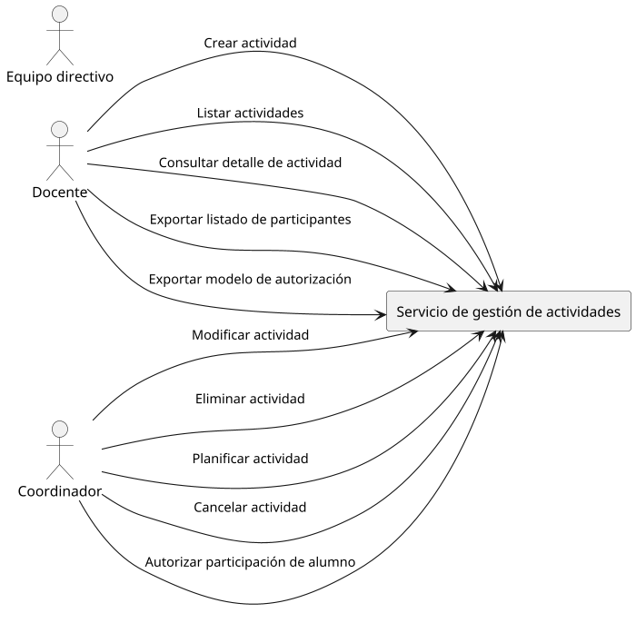

# 2. Requisitos Funcionales

El **servicio de gestión de actividades** deberá cumplir con los siguientes requisitos funcionales:

## 2.1 Centro educativo

### **RF1: Creación de actividades**
  
1. Un docente podrá crear una actividad asociada al centro educativo en el que se encuentre nombrado.
2. El creador de la actividad será coordinador de la actividad (por defecto).
3. El estado inicial de la actividad será **borrador**.
4. Cada actividad podrá tener la siguiente información:

| Campo                                      | Descripción                                                                              | Ejemplo                                                                     |
| ------------------------------------------ | ---------------------------------------------------------------------------------------- | --------------------------------------------------------------------------- |
| **Identificador de la actividad**          | Identificador único de la actividad.                                                     | Generado automáticamente                                                    |
| **Centro educativo**                       | Centro educativo que organiza la actividad.                                              | `IES XYZ (38000000)`                                                        |
| **Denominación**                           | Denominación de la actividad.                                                            | `Visita al museo de ciencias naturales`                                     |
| **Descripción**                            | Texto libre descriptivo de la actividad.                                                 | Explorar y disfrutar el museo dando sentido a los contenidos trabajados ... |
| **Tipo de actividad**                      | Ver **Tipos de actividades** en el documento [5. Modelo de datos](5-modelo-de-datos.md). | `Excursión`                                                                 |
| **Lugar de realización de la actividad**   | Lugar donde se realizará la actividad.                                                   | `Museo de ciencias naturales`                                               |
| **Periodo de realización de la actividad** | Fecha/hora de comienzo y de finalización de la actividad.                                | `15 de diciembre de 2025 de 9:00 a 12:00`                                   |
| **Periodo de autorización**                | Periodo para autorizar la participación por parte de los responsables.                   | `Hasta el 14 de abril de 2025 a las 23:59`                                  |
| **Observaciones**                          | Observaciones sobre la actividad.                                                        | `No se permite el uso de móviles`                                           |
| **Coste**                                  | Coste de la actividad (si procede).                                                      | `5€`                                                                        |
| **Teléfono de contacto**                   | Teléfono de contacto con el profesorado en caso de emergencia.                           | `666 666 666`                                                               |
| **Correo electrónico de contacto**         | Correo electrónico de contacto con el profesorado en caso de emergencia.                 | `cnorris@gobiernodecanarias.org`                                            |
| **Fecha/hora creación**                    | Fecha/hora de alta de la actividad.                                                      | `10/04/2025 10:30`                                                          |
| **Fecha/hora modificación**                | Fecha/hora de última modificación de la actividad.                                       | `10/04/2025 10:30`                                                          |
| **Estado de la actividad**                 | Ver **Estados de las actividades** en el [Modelo de datos](5-modelo-de-datos.md).        | `Borrador`                                                                  |
| **Alumnos participantes**                  | Alumnado del centro que participará en la actividad.                                     | - `Alumno 1 (3ºA)` - `Alumno 2 (3ºA)` - `Alumno 3 (3ºB)`            |
| **Docentes participantes**                 | Profesorado del centro acompaña al alumnado y/o coordina en la actividad.                | - `Chuck Norris` - `Bruce Lee`                                          |
| **Documentos adjuntos**                    | Documentos que se adjuntan a la actividad (folletos, normas de comportamiento, etc.).    | `📄 Folletos informativos`                                                   |

5. La denominación de la actividad será un texto libre obligatorio.
6. La descripción de la actividad será un texto libre obligatorio (en formato Markdown).
7. El tipo de actividad deberá ser uno de los tipos de actividad definidos en el sistema y será obligatorio.
   - Dependiendo del tipo de actividad, se podrá requerir la autorización de los responsables del alumnado (ver **Tipos de actividades** en el documento [5. Modelo de datos](5-modelo-de-datos.md)).
8. El periodo de realización de la actividad (fecha/hora de inicio y fin de la actividad) será obligatorio.
9. La fecha/hora límite de autorización deberá estar comprendido entre: 
   - La fecha/hora de planificación de la actividad (se establece la actividad en estado **planificado**).
   - La fecha/hora de inicio de realización de la actividad.
10. El coste de la actividad será un número decimal y será opcional (0 si no tiene coste).
    - Si la actividad tiene coste, se deberá indicar el coste por alumno.
    - El coste de la actividad no podrá ser negativo.
11. Se podrán vincular varios docentes a la actividad como coordinadores y/o acompañantes.
    - Siempre deberá haber como mínimo un docente coordinador vinculado a la actividad.
    - Sólo se podrá vincular docentes del mismo centro educativo al que pertenece la actividad.
    - Los docentes acompañantes podrán vincularse a un grupo de alumnos.
    - Un grupo de alumnos podrá tener 0 o más docentes acompañantes.
12. La actividad podrá tener 0 o más documentos adjuntos.
13. Los alumnos participantes se vincularán a la actividad mediante su matrícula.
    - Se podrá vincular alumnos específicos.
    - Se podrá vincular grupos completos.
14. El teléfono de contacto y el correo electrónico de contacto serán opcionales.
   
### **RF2: Modificación de actividades**

1. Un coordinador o el equipo directivo podrá modificar una actividad.
2. La actividad deberá encontrarse en estado **borrador** para poder modificarla completamente.
   - Se podrán modificar todos los campos de la actividad (ver RF1).
3. Una actividad en estado **planificada** sólo podrá ser modificada de forma parcial:
   - Se podrá añadir o quitar alumnos participantes.
     - Estos cambios en una actividad planificada deberán comunicarse a los reponsables de dichos alumnos.
   - Se podrá añadir o quitar docentes coordinadores y/o acompañantes.
   - Se podrá añadir o quitar documentos adjuntos.
   - Cualquier otra modificación de la actividad (denominación, descripción, tipo de actividad, lugar de realización, periodo de realización, fecha/hora límite de autorización, coste) no será posible.
     > ❌ En caso de error en una actividad **planificada**, se deberá **cancelar** la actividad y crear una nueva, pudiendo informar del error en el motivo de la cancelación si procede (ver RF5).

### **RF3: Eliminación de actividades**
  
1. Un coordinador o el equipo directivo podrá eliminar una actividad.
2. Sólo se podrá eliminar la actividad siempre y cuando esté en estado **borrador**.
3. Se eliminará toda la información asociada a dicha actividad (adjuntos, participantes, coordinadores, acompañantes, ...).
4. Si la actividad se encuentra en otro estado, sólo podrá ser **cancelada** (ver RF5).

### **RF4: Planificación de la actividad**

1. Una actividad en estado **borrador** podrá cambiarse a estado **planificada** por un coordinador o el equipo directivo.
2. En caso de que la actividad requiera autorización, se deberá enviar una **comunicación interna** a los responsables del alumnado.
   - Se enviará una comunicación a cada uno de los responsables del alumnado (o al propio alumno mayor de edad) informando que tiene pendiente de respuesta una autorización.
   - La comunicación incluirá una **referencia a la autorización**.
   - Cada uno de los responsables de un alumno recibirá una comunicación con la misma información y referencia.
   - Cada comunicación incluirá:

| Campo                                         | Descripción                                                                                                                                                          | Ejemplo                                                                                                                                                                                                                                                                       |
| --------------------------------------------- | -------------------------------------------------------------------------------------------------------------------------------------------------------------------- | ----------------------------------------------------------------------------------------------------------------------------------------------------------------------------------------------------------------------------------------------------------------------------- |
| **Tipo de comunicación**                      | Tipo de comunicación que se envía a los responsables del alumnado.                                                                                                   | `CSAU` (comunicación de solicitud de autorización). Ver [tabla](https://www3.gobiernodecanarias.org/aplicaciones/educacion/rm/projects/gestion-administrativa-y-academica-en-los-centros-educativos-pincel-ekade/wiki/ProyectosEkadiaAnalisisComunicacionesInternas)        . |
| **Asunto**                                    | Indicando que se ha recibido una solicitud de autorización.                                                                                                          | Solicitud de autorización para la actividad "Visita al museo de ciencias naturales"                                                                                                                                                                                           |
| **Breve descripción (contenido del mensaje)** | Mensaje genérico acerca de la solicitud de autorización para la actividad.                                                                                           | Ha recibido una solicitud de autorización para la participación de "Sylvester Stallone" en la actividad "Visita al museo de ciencias naturales", que se realizará en "Museo de ciencias naturales" desde el "15/12/2025 a las 9:00" hasta el "15/12/2025 a las 12:00"         |
| **Remitente**                                 | El coordinador (o cargo directivo en su defecto) que ha planificado la actividad (que la ha cambiado a estado **planificada**) será el remitente de la comunicación. | `Chuck Norris`                                                                                                                                                                                                                                                                |
| **Destinario**                                | Responsable del alumno (o al propio alumnado mayor de edad o emancipado) del que se requiere autorización.                                                           | `Jackie Chan`                                                                                                                                                                                                                                                                 |
| **Referencia a la autorización**              | La comunicación incluirá una referencia a la autorización. Esta referencia permitirá enlazar desde Ekadia con la autorización.                                       | `[PincelEkadeWeb].ATZ_Autorizaciones.IdAutorizacion`                                                                                                                                                                                                                          |

   - ℹ️ Las comnunicaciones internas no admitirán respuestas (unidireccional).

### **RF5: Cancelación de actividades**

1. Una actividad **planificada** podrá ser **cancelada** por un coordinador o el equipo directivo.
2. Se deberá registrar el cambio de estado de la actividad:
   - Docente coordinador que la canceló.
   - Fecha/hora de la cancelación.
   - Motivo de la cancelación (en observaciones del cambio de estado).
3. La actividad cancelada ya no podrá ser modificada (quedará bloqueada).
4. Las autorizaciones asociadas a los participantes de la actividad cancelada (si las hubiere) se establecerán como **canceladas** (ya no podrán cambiar de estado por parte los responsables del alumnado).
5. Se deberá enviar una comunicación interna a cada uno de los responsables del alumnado informando de la cancelación de la actividad (y por consiguiente, de la autorización), especificando el motivo de la cancelación:
   - Cada comunicación incluirá:

| Campo                                         | Descripción                                                                                                                                                      | Ejemplo                                                                                                                                                                                                                                                 |
| --------------------------------------------- | ---------------------------------------------------------------------------------------------------------------------------------------------------------------- | ------------------------------------------------------------------------------------------------------------------------------------------------------------------------------------------------------------------------------------------------------- |
| **Tipo de comunicación**                      | Tipo de comunicación que se envía a los responsables del alumnado.                                                                                               | `CSAU`                                                                                                                                                                                                                                                  |
| **Asunto**                                    | Indicando que se ha cancelado la actividad.                                                                                                                      | Cancelación de la actividad "Visita al museo de ciencias naturales"                                                                                                                                                                                     |
| **Breve descripción (contenido del mensaje)** | Mensaje genérico indicando el motivo de la cancelación de la actividad.                                                                                          | Se ha cancelado la actividad "Visita al museo de ciencias naturales" en la que iba a participar "Sylvester Stallone", planificada en "Museo de ciencias naturales" desde el "15/12/2025 a las 9:00" hasta el "15/12/2025 a las 12:00" por "Mal tiempo". |
| **Remitente**                                 | El coordinador (o cargo directivo en su defecto) que ha cancelado la actividad (que la ha cambiado a estado **cancelada**) será el remitente de la comunicación. | `Chuck Norris`                                                                                                                                                                                                                                          |
| **Destinario**                                | Responsable del alumno (o al propio alumnado mayor de edad o emancipado) al que se quiere informar.                                                              | `Jackie Chan`                                                                                                                                                                                                                                           |
| **Referencia al alumno participante**         | La comunicación incluirá una referencia a la autorización. Esta referencia permitirá enlazar desde Ekadia con la autorización.                                   | `[PincelEkadeWeb].ATZ_Autorizaciones.IdAutorizacion`                                                                                                                                                                                                    |
   - ℹ️ Estas comnunicaciones internas no admitirán respuestas (unidireccional).
  
### **RF6: Listado de actividades**

1. Cualquier docente podrá **listar todas las actividades** de su centro educativo (excepto las que estén en estado **borrador**).
2. Un docente sólo podrá **listar las actividades** en estado **borrador** si figura como docente participante o es un cargo directivo.
3. De cada actividad se mostrará:

| Campo                                       | Descripción                                                                                            | Ejemplo                                                   |
| ------------------------------------------- | ------------------------------------------------------------------------------------------------------ | --------------------------------------------------------- |
| **Denominación**                            | Denominación de la actividad.                                                                          | `Visita al museo de ciencias naturales`                   |
| **Estado de la actividad**                  | Ver **Estados de las actividades** en el documento [5. Modelo de datos](5-modelo-de-datos.md).         | `Planificada`                                             |
| **Periodo de realización de la actividad**  | Fecha/hora de inicio y fin de la actividad.                                                            | `15/12/2025 9:00 - 12:00`                                 |
| **Tipo de actividad**                       | Ver **Tipos de actividades** en el documento [5. Modelo de datos](5-modelo-de-datos.md).               | `Excursión`                                               |
| **Requiere autorización**                   | Indica si la actividad requiere autorización de los responsables del alumnado.                         | `✅`                                                       |
| **Autorizaciones**                          | Indica las autorizaciones pendientes de respuesta (en caso de que la actividad requiera autorización). | `✅ 5 aceptadas` `❌ 2 rechazadas` `⌛ 7 pendientes` |
| **Grupos participantes**                    | Relación de grupos y cantidad de alumnosque participan en la actividad.                                | `3ºA (5), 3ºB (3), 3ºC (6)`                               |
| **Cantidad de solicitudes de autorización** | Cantidad de solicitudes de autorización enviadas y autorizadas.                                        | `Enviadas: 30, Autorizadas: 25`                           |
| **Participación**                           | Indica si el docente es coordinador y/o acompañante.                                                   | `✅ Acompañante` `❌ Coordinador`                       |

   > ℹ️ La relación de grupos participantes implica que al menos algún alumno de ese grupo participará en la actividad.

4. Las actividades se podrán **ordenar** por:
   - Fecha/hora de inicio y fin de la actividad (por defecto, en orden descendente).
   - Denominación.
5. Las actividades se podrán **agrupar** por:
   - Tipo de actividad.
   - Estado de la actividad.
6. Las actividades se podrán **filtrar** por:
   - Curso escolar (filtro por defecto).
   - Denominación.
   - Tipo de actividad.
   - Estado de la actividad.
   - Rango de fechas de realización.
7. De cada actividad se podrá consultar el detalle (ver RF7).

### **RF7: Consulta del detalle de una actividad**

1. El detalle de una activiad deberá presentar todos los datos de una actividad seleccionada (RF6):
   - Se presentarán los mismos datos que al crear la actividad (ver RF1).
   - En el listado de alumnos participantes se indicará el estado de la autorización (si procede): AUTORIZADA, RECHAZADA, PENDIENTE.
   - Un autorización se considerará pendiente cuando no figure ninguna autorización asociada al alumno participante.
2. Desde el detalle de la actividad se podrán realizar las siguientes acciones sobre la misma:
   - Planificar la actividad (ver RF4).
     - Si la actividad está en estado **borrador**, se podrá planificar la actividad.
   - Modificar la actividad (ver RF2).
     - Si la actividad está en estado **borrador**, se podrá modificar la actividad sin restricciones.
     - Si la actividad está en estado **planificada**, se podrá modificar la actividad parcialmente (ver RF2).
   - Cancelar la actividad (ver RF5).
     - Si la actividad está en estado **planificada**, se podrá cancelar la actividad.
   - Finalizar la actividad (ver RF6).
     - Si la actividad está en estado **planificada**, se podrá finalizar la actividad.
   - Exportar un informe con el listado de participantes (ver RF8).
   - Exportar un modelo de autorización de la actividad para su presentación física (ver RF9). ❗ **[casos excepcionales]**
   - Autorizar la participación de un alumno en la actividad (ver RF10).

### **RF8: Exportación del listado de participantes**

1. Se podrá exportar el listado de participantes de una actividad.
   - Esto facilitará al docente llevar un control manual de asistencia del alumnado autorizado y no autorizado durante la realización de la actividad.
2. El formato de exportación será PDF.
3. El documento incluirá un **encabezado** con los siguientes datos cumplimentados:

| Detalle                                    | Descripción                                                              | Ejemplo                                 |
| ------------------------------------------ | ------------------------------------------------------------------------ | --------------------------------------- |
| **Centro educativo**                       | Denominación y código del centro educativo.                              | `IES XYZ (38000000)`                    |
| **Denominación de la actividad**           | Denominación de la actividad.                                            | `Visita al museo de ciencias naturales` |
| **Tipo de actividad**                      | Tipo de actividad.                                                       | `Excursión`                             |
| **Periodo de realización de la actividad** | Fecha/hora de inicio y fin de la actividad.                              | `15/12/2025 9:00 - 15/12/2025 12:00`    |
| **Cantidad de docentes acompañantes**      | Total de profesores acompañantes.                                        | `Docentes: 5`                           |
| **Cantidad de alumnos participantes**      | Total de alumnos autorizados y convocados.                               | `Autorizados: 25 de 30`                 |
| **Grupos participantes**                   | Relación de grupos y cantidad de alumnos que participan en la actividad. | `3ºA (5), 3ºB (12), 3ºC (7)`            |

   > ℹ️ En caso de que la actividad no requiera autorización, autorizados y convocados serán los mismos.

4. El documento incluirá en el **cuerpo** los siguientes datos cumplimentados:
   - **Listado de profesorado** acompañante.
   - **Listado de alumnado** participante agrupado por grupo, indicando por cada alumno:
     - Nombre y apellidos.
     - Si está autorizado o no (si procede).
     - Si ha abonado el coste de la actividad (si procede).
     - Si hay algún comentario o circunstancia de interés especial informada por el responsable en la autorización.
     - Espacio para que el docente pueda marcar la asistencia del alumnado.
   - **Listado de alumnado con observaciones** en la autorización.
     - Nombre y apellidos del alumno.
     - Observaciones informadas por el responsable en la autorización.
5. El documento incluirá un **pie de página** con los siguientes datos cumplimentados:   
   - Incluirá la fecha/hora de exportación del listado.
   - Si la actividad está en estado **borrador**, se indicará que el listado es provisional.

### **RF9: Exportación del modelo de autorización**

1. Se podrá exportar un modelo de autorización para aquellas actividades que por su tipología lo requieran.
   - Esto permitirá en casos excepcionales que un responsable firme la autorización en formato físico (papel).
2. El formato de exportación será en PDF.
3. El documento incluirá un **encabezado** con los siguientes datos cumplimentados:

| Detalle                                              | Descripción                                                              | Ejemplo                                 |
| ---------------------------------------------------- | ------------------------------------------------------------------------ | --------------------------------------- |
| **Centro educativo**                                 | Denominación y código del centro educativo.                              | `IES XYZ (38000000)`                    |
| **Denominación de la actividad**                     | Denominación de la actividad.                                            | `Visita al museo de ciencias naturales` |
| **Descripción de la actividad**                      | Descripción de la actividad.                                             | `El alumnado de 3º de primaria ...`     |
| **Periodo de realización de la actividad**           | Fecha/hora de inicio y fin de la actividad.                              | `15/12/2025 9:00 - 15/12/2025 12:00`    |
| **Cantidad de docentes acompañantes**                | Total de profesores acompañantes.                                        | `Docentes: 5`                           |
| **Cantidad de alumnos participantes**                | Total de alumnos convocados.                                             | `30`                                    |
| **Grupos participantes**                             | Relación de grupos y cantidad de alumnos que participan en la actividad. | `3ºA (5), 3ºB (15), 3ºC (10)`           |
| **Coordinador de la actividad**                      | Nombre y apellidos del coordinador de la actividad.                      | `Chuck Norris`                          |
| **Teléfono de contacto para emergencias**            | Teléfono de contacto del coordinador de la actividad.                    | `666 666 666`                           |
| **Dirección de correo de contacto para emergencias** | Teléfono de contacto del coordinador de la actividad.                    | `cnorris@gobcan.es`                     |

4. El documento incluirá en el **cuerpo** espacio para los siguientes datos:
   - Nombre y apellidos del responsable del alumnado que firma la autorización.
   - Nombre y apellidos del alumno.
   - Dirección del responsable del alumno.
   - Teléfono de contacto del responsable del alumno.
   - Circunstancias de interés especial: enfermedad, alergias, etc. (observaciones).
   - DNI y firma del responsable del alumno.
   - DNI y firma del alumno mayor de edad o emancipado.
5. El documento incluirá un **pie de página** con los siguientes datos cumplimentados:   
   - Incluirá la fecha/hora de exportación del modelo.
   - Si la actividad está en estado **borrador**, se indicará que el modelo es provisional.

|        |
| ------------------------------------------------ |
| *Ejemplo de modelo de solicitud de autorización* |

### **RF10: Autorización de la participación de un alumno en la actividad (autorización manual)**

1. Un coordinador o un cargo directivo podrá establecer como autorizada la participación de un alumno en la actividad.
   - Deberá encontrarse la actividad en estado **planificada**.
2. Deberá indicar el responsable del alumno que ha firmado la autorización.
   - Se podrá seleccionar entre los responsables del alumno que figuran en el sistema.
3. Deberá adjuntar copia del documento de autorización firmado por el responsable del alumno.
4. El estado de la autorización del alumno pasará a estar en estado **autorizada**.

## 2.2 Responsables del alumnado

### **RF11: Recepción de comunicaciones de autorizaciones pendientes**

1. Los responsables recibirán una comunicación interna donde se les notifica que tienen una autorización pendiente de un alumno del que son responsables.
2. La comunicación recibida incluirá la información indicada en RF4.2.
   - Destacar que la comunicación incluirá una **referencia al alumno participante** en el servicio de autorizaciones.
   - Esta referencia permitirá enlazar desde Ekadia con el detalle de la actividad (ver RF13).
3. La comunicación no admitirá respuestas (unidireccional).
> ℹ️ Se deberá autorizar de forma individual por alumno, ya que se puede ser responsable de varios alumnos que participen en la misma actividad, y habrá que autorizar a cada uno de ellos por separado.

### **RF12: Listado de autorizaciones**

1. Los responsables podrán listar las autorizaciones:
   - Se listarán las autorizaciones pendientes de respuesta y las autorizaciones con respuesta.
   - Se listarán las autorizaciones de los alumnos de los que son responsables (o el propio alumno mayor de edad o emancipado). 
2. El listado de autorizaciones mostrará la siguiente información:

| Centro educativo           | Descripción                           | Tipo de actividad | Periodo de realización  | Periodo de firma                               | Alumno             | Responsable | Estado                                                             |
| -------------------------- | ------------------------------------- | ----------------- | ----------------------- | ---------------------------------------------- | ------------------ | ----------- | ------------------------------------------------------------------ |
| `IES XYZ` `(38000000)` | Visita al museo de ciencias naturales | `Excursión`       | `15/12/2025 9:00-12:00` | `10/04/2025 0:00` - `14/04/2025 23:59` | Sylvester Stallone | Jackie Chan | `⌛Pendiente` `✅Autorizado` `❌No autorizado` `Caducada` |

   - Se mostrará el responsable que respondió a la autorización o vacío si está pendiente de respuesta.
   - Las autorizaciones pendientes fuera de plazo de autorización se mostrarán como **caducadas**.
3. El listado se podrá **agrupar** por:
   - Estado de la autorización.
   - Alumno (matrícula) (por defecto).
4. El listado se podrá **filtrar** por:
   - Estado de la autorización (activa por defecto).
   - Centro educativo
   - Tipo de actividad.
   - Rango de fechas de realización.
5. El listado se ordenará en orden descendente por fecha de recepción de la solicitud.
6. Se ofrecerán las siguientes acciones:
   - Consultar el detalle de la autorización (ver RF13).
   - Autorizar o rechazar la participación de un alumno en una actividad (ver RF12).

### **RF13: Consulta del detalle de las autorizaciones**

1. Los responsables podrán consultar el detalle de una solicitud de autorización.
2. La referencia de las comunicaciones internas enviadas a los responsables permitirá consultar o acceder a este detalle directamente (ver RF11.2).
3. El detalle de una solicitud de autorización deberá incluir:

| Detalle                       | Descripción                                                                                      | Ejemplo                                                                                                                                                                      |
| ----------------------------- | ------------------------------------------------------------------------------------------------ | ---------------------------------------------------------------------------------------------------------------------------------------------------------------------------- |
| **Asunto**                    | Denominación de la actividad                                                                     | `Visita al museo de ciencias naturales`                                                                                                                                      |
| **Descripción**               | Descripción de la actividad                                                                      | El alumnado de 3º de primaria realizará una visita al museo de ciencias naturales el día 15 de diciembre de 2025, de 9:00 a 12:00 horas. La actividad tendrá un coste de 5€. |
| **Documentos adjuntos**       | Documentos adjuntos a la solicitud                                                               | `Folleto informativo de la actividad (JPG)` `Normas de comportamiento durante la actividad (PDF)`                                                                        |
| **Periodo de la actividad**   | Periodo de realización de la actividad                                                           | `Desde 5/5/2025 9:00` - `Hasta 5/5/2025 13:00`                                                                                                                               |
| **Periodo de autorización**   | Periodo en que se puede dar respuesta a la autorización por parte de los responsables del alumno | `Desde 10/4/2025 0:00` - `Hasta 14/4/2025 23:59`                                                                                                                             |
| **Estado de la autorización** | Última respuesta de la autorización.                                                             | `⌛Pendiente` `✅Autorizado` `❌No autorizado` `Caducada`                                                                                                           |
| **Responsable que autorizó**  | Nombre y apellidos del responsable que dio la última respuesta a la autorización                 | `Jackie Chan`                                                                                                                                                                |

4. Se podrán descargar los adjuntos para su consulta.
5. Desde el detalle de la autorización se podrán realizar las siguientes acciones:
   - Autorizar o rechazar la participación de un alumno en una actividad (ver RF14) dentro de plazo.
   - Revocar autorización (ver RF15). 
     > ⚠️ ¡Funcionalidad pendiente para futuras versiones!

### **RF14: Autorización o rechazo de la participación de un alumno en una actividad** 

1. Los responsables podrán autorizar o rechazar (NO autorizar) una autorización de participación.
2. Las posibles respuestas son: **autorizo**, **no autorizo**.
3. Podrán especificar observaciones o circunstancias de interés especial (en caso de autorización).
   - Estas observaciones se mostrarán en el listado de participantes de la actividad (ver RF8).
4. Podrán hacerlo desde la vista de detalle de la autorización (ver RF13) y desde el listado de autorizaciones (acción rápida) (ver RF12.6).
5. Sólo se podrá autorizar o rechazar una autorización si está en periodo de firma.
6. Cada vez que un responsable cambie el estado de la autorización, se registrará la fecha y el responsable que realizó el cambio.
7. Concluido el plazo de autorización de la actividad, un responsable ya no podrá cambiar el estado de la autorización.

### **RF15: Revocación de una autorización** 

> ⚠️ ¡Funcionalidad pendiente para futuras versiones!

1. Una autorización podrá ser revocada por alguno de los responsables del alumnado (o alumno mayor de edad o emancipado).
2. Podrán hacerlo desde la vista de detalle de la autorización.
3. Sólo se podrá revocar una solicitud de autorización si está en estado **autorizada**, fuera del plazo de autorización y previo a la realización de la actividad.
   - Si la actividad no se ha realizado, se podrá revocar la autorización.
   - Si la actividad ya se ha realizado, no se podrá revocar la autorización.
4. El responsable y la fecha de revocación quedarán registrados.
5. Al tratarse de una acción irreversible, se deberá solicitar confirmación al responsable del alumnado antes de proceder a la revocación de la autorización.
