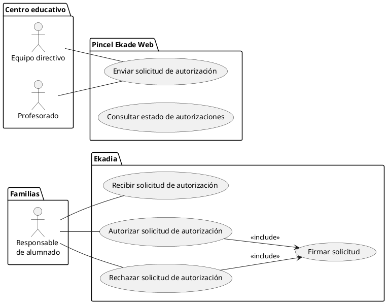

# [AF] Servicio de Gestión de autorizaciones de Ekadia

## 1. Introducción

### Descripción general del documento

Este documento describe el **análisis funcional (AF)** del **servicio de gestión de autorizaciones** a desarrollar en la fase 2 de mantenimiento de **Ekadia**. [HU#251627](https://www3.gobiernodecanarias.org/aplicaciones/educacion/rm/issues/251627)

Su objetivo es detallar los requisitos funcionales y no funcionales, flujos de trabajo, modelo de datos, interfaces, y demás aspectos técnicos que rigen su desarrollo e implementación.

### Alcance del documento

El alcance de este análisis funcional se limita a la definición y especificación del **servicio de gestión de autorizaciones**, incluyendo:

- Funcionalidades principales y secundarias del servicio.
- Interacciones con otros módulos o servicios de la aplicación o aplicaciones web.
- Restricciones y consideraciones técnicas.

Este documento **no** cubre aspectos fuera del servicio en cuestión, como otros módulos de la aplicación no relacionados directamente con su funcionamiento.

## 2. Contexto y objetivos del servicio

### Aplicaciones disponibles actualmente

Actualmente hay disponibles varios aplicativos que permiten hacer trámites, consultas y gestiones tanto a personal docente como al alumnado y/o a sus responsables, que permiten el intercambio de información entre familias y centros educativos.

Estas aplicaciones son:

* [**Pincel Ekade Web**](https://www.gobiernodecanarias.org/educacion/PEKWEB/Ekade/Docentes/GestionAcademica): aplicación web que ofrece diversas funcionalidades destinadas a docentes, equipos directivos, alumnado y familias.

* [**Pincel Ekade móvil**](https://www.gobiernodecanarias.org/educacion/PEKWEB/Ekade/Movil/): versión reducida de Pincel Ekade Web adaptada para móviles.  

* [**Pincel Alumnado y Familias (App Familias)**](https://play.google.com/store/apps/details?id=org.gobiernodecanarias.ceu.appfamilias&hl=es&pli=1): aplicación móvil disponible para Android e iOS para la comunicación con las familias.

Ninguno de las aplicaciones anteriores cuenta con un sistema de gestión de autorizaciones que permita el envío y recepción de solicitudes de autorización entre centros educativos y familias.

### Aplicaciones en desarrollo 

* **Ekadia**: Nueva aplicación web para el intercambio de información con las familias (alumnado y responsables), que actualmente se encuentra en fase 2 de desarrollo.

### Objetivos del servicio

El servicio de gestión de autorizaciones tiene como objetivo principal permitir a los centros educativos y a las familias gestionar las autorizaciones necesarias para la realización de actividades extraescolares, salidas, excursiones, etc.

Este servicio permitirá a los centros educativos enviar solicitudes de autorización a las familias, y a estas autorizar o rechazar dichas solicitudes. Además, permitirá a los centros educativos y a las familias consultar el estado de las autorizaciones, así como el historial de las mismas.

El servicio se implementará en **Ekadia** para las familias, y en **Pincel Ekade Web** para los centros educativos.

### 3. Requisitos Funcionales

El **servicio de autorizaciones** deberá permitir la gestión de autorizaciones entre los centros educativos y las familias, con las siguientes características:

> Sólo podrán firmar autorizaciones los responsables de alumnado o el alumnado mayor de edad.

#### 3.1. Funciones que debe cumplir el servicio
   
- **Enviar solicitud de autorización**: Los centros educativos podrán crear y enviar solicitudes de autorización a los responsables del alumnado o al alumnado mayor de edad.
- **Recibir solicitud de autorización**: los responsables del alumnado recibirán las solicitudes de autorización. Deberán ser notificados de la recepción de una nueva solicitud.
- **Autorizar o rechazar solicitud de autorización**: los responsables del alumnado podrán autorizar o rechazar las solicitudes de autorización recibidas. Además deberán firmar la autorización.
- **Consultar estado de autorizaciones**: los centros educativos y los responsables del alumnado podrán consultar el estado de las autorizaciones enviadas y recibidas.
- **Recibir notificaciones**: los responsables del alumnado recibirán notificaciones de nuevas solicitudes de autorización.
- **Consultar historial de autorizaciones**: los centros educativos y los responsables del alumnado podrán consultar el historial de autorizaciones enviadas y recibidas.
- **Gestionar autorizaciones**: los centros educativos y los responsables del alumnado podrán gestionar las autorizaciones enviadas y recibidas.
- **Consultar autorizaciones**: los centros educativos y los responsables del alumnado podrán consultar las autorizaciones.
  - **Pendientes**: Pendientes de respuesta.
  - **Autorizadas**: Autorizadas y firmadas.
  - **No autorizadas**: No autorizadas y firmadas.
  - **Caducadas**: Fuera de plazo y no firmadas. Equivale a no autorizadas.
  - **Por tipo**: Los tipos de autorizaciones podrían ser: salidas, excursiones, actividades extraescolares, etc.
  - **Por rangos de fechas**: Fecha de la solicitud, fecha de la autorización, fecha de caducidad.
  - **Por curso**: los centros educativos podrán consultar las autorizaciones por curso.
  - **Por alumno**: los centros educativos podrán consultar las autorizaciones por alumno.
  - **Consultar autorizaciones por responsable**: los centros educativos y los responsables del alumnado podrán consultar las autorizaciones por responsable.

#### 3.2. Casos de uso

Los casos de uso del servicio de autorizaciones son los siguientes:

- CU1: **Enviar solicitud de autorización**
- CU2: **Recibir solicitud de autorización**
- CU3: **Autorizar solicitud de autorización**
- CU4: **Rechazar solicitud de autorización**
- CU5: **Firmar solicitud**
- CU6: **Consultar estado de autorizaciones**
- CU7: **Recibir notificaciones**
- CU8: **Consultar historial de autorizaciones**
- CU9: **Gestionar autorizaciones**
- CU10: **Consultar autorizaciones**
    

    
1. Casos de uso específicos con descripciones.
2. Flujos de trabajo del usuario.
3. Restricciones y validaciones necesarias.

### 4. Requisitos No Funcionales

- Requisitos de rendimiento (tiempos de respuesta, concurrencia, etc.).
- Seguridad y control de acceso.
- Escalabilidad y mantenibilidad.
- Compatibilidad con dispositivos y navegadores.

### 5. **Modelo de Datos**

- Entidades principales del servicio.
- Relación entre entidades.
- Esquema de base de datos (si aplica).
- Validaciones y restricciones de datos.

### 6. **Interfaces del Servicio**

- Pantallas o vistas afectadas por el servicio (mockups o wireframes).
- API (si aplica):
  - Endpoints y métodos HTTP.
  - Formato de las peticiones y respuestas.
  - Códigos de error y manejo de excepciones.

### 7. **Diagrama de Flujo o Arquitectura**

- Diagramas de flujo que describan el comportamiento del servicio.
- Interacción con otros servicios o sistemas.
- Arquitectura técnica (si es relevante).

### 8. **Casos de Uso y Escenarios de Prueba**

- Escenarios funcionales detallados.
- Casos de prueba para validación.
- Pruebas de rendimiento o carga (si aplican).

### 9. **Consideraciones de Seguridad y Privacidad**

- Controles de acceso y permisos.
- Cifrado de datos en tránsito y en reposo.
- Cumplimiento con normativas (ej. GDPR, ISO 27001).

### 10. **Limitaciones y Posibles Mejoras**

- Restricciones técnicas o de negocio.
- Futuras evoluciones del servicio.

### 11. **Referencias y Anexos**

- [DD#250632](https://www3.gobiernodecanarias.org/aplicaciones/educacion/rm/issues/250632): Plan de transformación digital de la gestión educativa: Portal de alumnado y responsables (Ekadia).
  - [PS#251627](https://www3.gobiernodecanarias.org/aplicaciones/educacion/rm/issues/251627): Análisis de los servicios a desarrollar en la nueva fase de mantenimiento de Ekadia
    - [HU#254526](https://www3.gobiernodecanarias.org/aplicaciones/educacion/rm/issues/254526): [Ekadia] Análisis funcional para el servicio de autorización de actividades extraescolares.
    - [HU#254905](https://www3.gobiernodecanarias.org/aplicaciones/educacion/rm/issues/254905): [SENECA] [1] Comprobar solicitudes de Actividades Extraescolares.Perfil de Centro.
    - [HU#254914](https://www3.gobiernodecanarias.org/aplicaciones/educacion/rm/issues/254914): Autorización Actividades Extraescolares.Perfil Director o Profesor.

