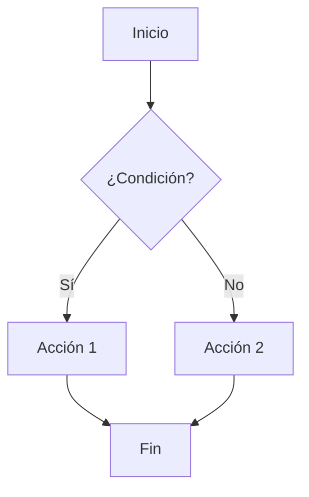

# Caso de prueba de marktile + mermaid

En este caso de prueba se intenta renderizar un diagrama de flujo en formato `mermaid` usando `marktile`.

> La idea es verificar que el diagrama se renderiza correctamente y se incluye en el documento `.textile` de salida.

## Diagrama de flujo

