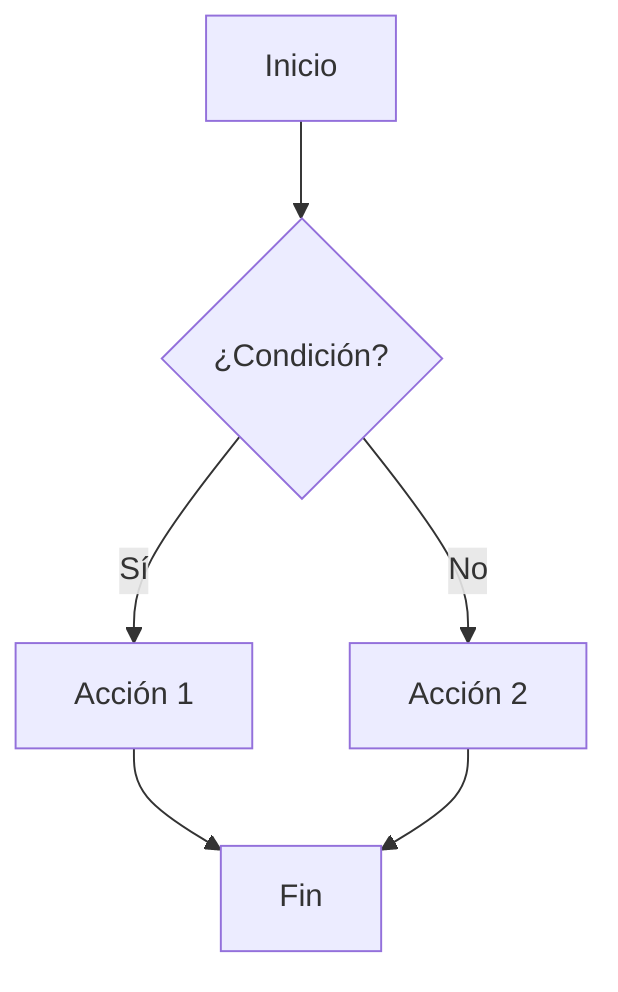
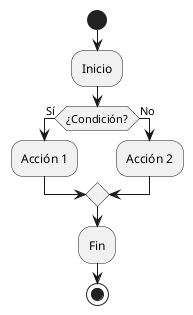

# Casos de prueba de marktile

## Diagramas Mermaid

En este caso de prueba se intenta renderizar un diagrama de flujo en formato `mermaid` usando `marktile`.

> La idea es verificar que el diagrama se renderiza correctamente y se incluye en el documento `.textile` de salida.

### Diagrama Mermaid

## Diagrama PlantUML

En este caso de prueba se intenta renderizar un diagrama de flujo en formato `plantuml` usando `marktile`.

> La idea es verificar que el diagrama se renderiza correctamente y se incluye en el documento `.textile` de salida.

### Diagrama PlantUML

## Tablas

En este caso de prueba se muestran las tablas en marktile y su formato:

| Nombre | Edad | Ciudad     |
|--------|------|------------|
| Juan   | 25   | Madrid     |
| Ana    | 30   | Barcelona  |
| Pedro  | 22   | Valencia   |
| Laura  | 28   | Sevilla    |
| Carlos | 35   | Bilbao     |

## Listas

1. Casos de uso específicos con descripciones.
2. Flujos de trabajo del usuario.
3. Restricciones y validaciones necesarias.
